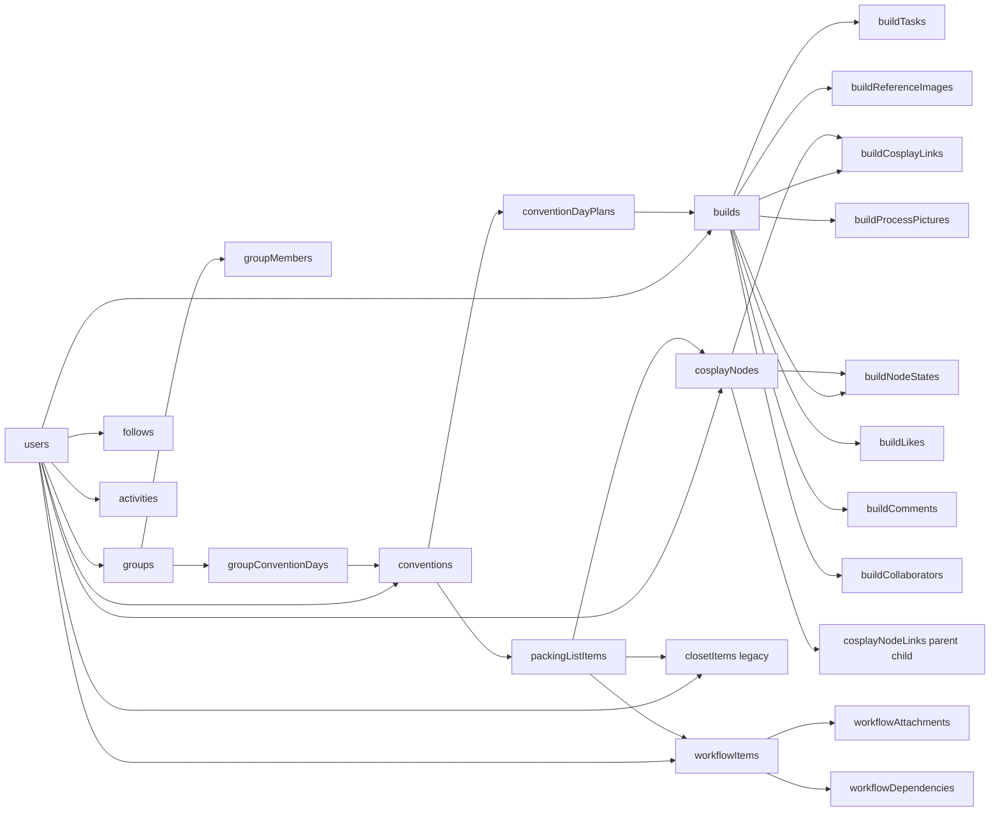

# Kyarafit Mobile Rebuild — Finalized Blueprint

**Status:** canonical. This is the single source document for the Kyarafit mobile rebuild. It supersedes any prior `PHASE_0_AUDIT.md`, `PHASE_1_FOUNDATION.md`, and `PHASES_2_4_IMPLEMENTATION.md` that previously lived in this folder.

**Last updated:** 2026-04-22 (rolling — see §6 _Rolling implementation status_; web is now the canonical design-system source via shared token adapters; mobile ThemeProvider now drives NativeWind dark mode; targeted design-system color linting added on migrated mobile surfaces; built-screen-first parity audit landed in [`NATIVE_BUILT_SCREEN_AUDIT.md`](./NATIVE_BUILT_SCREEN_AUDIT.md); current built-screen pass now includes native font rollout, tab-header typography, collapsible filter panels, `+` FAB creation menus, a summary-first build-detail explorer refresh, drag-scroll lock + finger-following explorer ghosting, the high-volume link-elements surface, planner grouped tasks/events/agenda plus in-row reorder and nest/promote structure controls, planner dependency previews sourced from `workflowDependencies`, shared workflow task editing + template application on planner/build detail, direct create-element/create-material actions inside the build explorer, in-sheet child creation/drill-in actions for explorer selection, element/build destructive-management parity on detail flows, a stronger editorial home hierarchy with actionable next steps, shared nav parity restored for the `Builds` label plus mobile tab icons now deriving from the same shared section semantics as web, native account now includes profile-photo picking/cropping plus live username availability feedback, public build cards now support likes and comment threads natively, public social taps now route into a dedicated native public-build viewer modeled on the web public build page instead of the private editor route, the Phase 5 native conventions/packing/itinerary stack replacing the previous browser bridge for Events, native Settings account/subscription/notifications subpages, and native Groups / Feed / Discover / Profile stacks replacing the previous overflow browser bridge.)

**Applied decisions** (all merged into this document):

- Expo SDK 55 pin + iOS 16 / Android 11 device floor.
- Hermes V1 opt-in on iOS and Android with Hermes bytecode diffing for EAS Update.
- Greenfield billing — zero existing Stripe subscribers, all Stripe code purged from `web/` in Phase 0.
- AI-only i18n pipeline (en → ja, es) at build time.
- Admin role + `/admin/broadcasts` web page + broadcasts/userPushPreferences Convex schema.
- Transactional + opt-in marketing push notifications via Expo Push.
- Locale screenshot audit (en/ja/es) in Phase 9.
- Localized App Store / Play Store listings in Phase 10.
- New architectural sections 3.16 (i18n), 3.17 (push), 3.18 (admin), 3.19 (JS engine + OTA).
- Timeline: ~15.5 weeks single-dev pace.

**Hard ground truth**

- Web app (`web/`) is the only source of truth for product behavior.
- `mobile/` is the **active** Expo SDK 55 app (greenfield rebuild in this monorepo). It shares `convex/` and `design-system/` with web; keep parity per `rules/mobile-parity.mdc`.
- Convex (`convex/`) and `design-system/` are shared. Mobile binds to the same schema and types.
- Scope: all authenticated product surfaces at full parity. Out of scope: landing pages (`web/src/app/page.tsx`, `web/src/components/landing/`\*), Remotion, `/demo/gallery`, `/dev/seed`, legacy routes `/build-detail` and `/closet` (deprecated in favor of `/b/[buildId]` and `/elements`). Keep public share (`/b/s/[shareToken]`) in-scope because it is a first-class share feature, but render it read-only in the mobile app (optional deep-link).
- Web plan for **public vs unlisted** viewer (parity with private build detail + editorial-informed design): [PUBLIC-BUILD-DETAIL-PLAN.md](../PUBLIC-BUILD-DETAIL-PLAN.md). Mobile backlog after that ships: [FOLLOWUP-public-build-viewer.md](FOLLOWUP-public-build-viewer.md).

---

## 1. Product Extraction from Web

Source enumeration: `web/src/app/**/page.tsx` (43 routes) and `convex/*.ts` (27 modules). Shared nav at [design-system/navConfig.ts](design-system/navConfig.ts).

### 1.1 Primary product areas (with routes)

- **Auth** — [web/src/app/auth/signin/page.tsx](web/src/app/auth/signin/page.tsx), [signup](web/src/app/auth/signup/page.tsx), [verify-email](web/src/app/auth/verify-email/page.tsx), [verify-email/inbox](web/src/app/auth/verify-email/inbox/page.tsx), [reset-password](web/src/app/auth/reset-password/page.tsx). Backing: [convex/auth.ts](convex/auth.ts), [convex/email.ts](convex/email.ts), [convex/auth.config.ts](convex/auth.config.ts). Uses `@convex-dev/better-auth`.
- **Home** — [web/src/app/home/page.tsx](web/src/app/home/page.tsx). Dashboard: focused build, upcoming conventions, next tasks, recent activity.
- **Builds** — list [builds/page.tsx](web/src/app/builds/page.tsx), new [builds/new/page.tsx](web/src/app/builds/new/page.tsx), detail [b/[buildId]/page.tsx](web/src/app/b/[buildId]/page.tsx), public share [b/s/[shareToken]/page.tsx](web/src/app/b/s/[shareToken]/page.tsx). Backing: [convex/builds.ts](convex/builds.ts), [convex/buildTasks.ts](convex/buildTasks.ts), [convex/buildItemLinks (in closetItems)](convex/closetItems.ts), [convex/buildReferenceImages.ts](convex/buildReferenceImages.ts), [convex/buildProcessPictures.ts](convex/buildProcessPictures.ts), [convex/buildCollaborators.ts](convex/buildCollaborators.ts), [convex/buildComments.ts](convex/buildComments.ts), [convex/buildLikes.ts](convex/buildLikes.ts), plus the cosplayNode graph ([convex/cosplayNodes.ts](convex/cosplayNodes.ts)).
- **Elements (new cosplay graph)** — list [elements/page.tsx](web/src/app/elements/page.tsx), new [elements/new/page.tsx](web/src/app/elements/new/page.tsx), detail [elements/[id]/page.tsx](web/src/app/elements/[id]/page.tsx). Backing: [convex/cosplayNodes.ts](convex/cosplayNodes.ts) with `cosplayNodes`, `cosplayNodeLinks`, `buildCosplayLinks`, `buildNodeStates` tables.
- **Conventions ("Events")** — list [conventions/page.tsx](web/src/app/conventions/page.tsx), new [conventions/new/page.tsx](web/src/app/conventions/new/page.tsx), detail [conventions/[id]/page.tsx](web/src/app/conventions/[id]/page.tsx), edit [conventions/[id]/edit/page.tsx](web/src/app/conventions/[id]/edit/page.tsx), packing [conventions/[id]/packing/page.tsx](web/src/app/conventions/[id]/packing/page.tsx). Backing: [convex/conventions.ts](convex/conventions.ts), `conventionDayPlans`, `packingListItems`.
- **Packing (cross-convention)** — [packing/page.tsx](web/src/app/packing/page.tsx).
- **Itinerary (cross-convention day timeline)** — [itinerary/page.tsx](web/src/app/itinerary/page.tsx).
- **Planner (workflow)** — [planner/page.tsx](web/src/app/planner/page.tsx). Backing: [convex/workflow.ts](convex/workflow.ts) with `workflowItems`, `workflowAttachments`, `workflowDependencies`, `workflowTemplates`, `workflowTemplateItems`.
- **Groups** — list [groups/page.tsx](web/src/app/groups/page.tsx), new [groups/new/page.tsx](web/src/app/groups/new/page.tsx), detail [g/[groupId]/page.tsx](web/src/app/g/[groupId]/page.tsx). Backing: [convex/groups.ts](convex/groups.ts), [convex/groupConventionDays.ts](convex/groupConventionDays.ts).
- **Feed / Discover / Profile / Social** — [feed/page.tsx](web/src/app/feed/page.tsx), [discover/page.tsx](web/src/app/discover/page.tsx), [u/[username]/page.tsx](web/src/app/u/[username]/page.tsx). Backing: [convex/follows.ts](convex/follows.ts), [convex/buildLikes.ts](convex/buildLikes.ts), [convex/buildComments.ts](convex/buildComments.ts), `activities` table.
- **Settings** — root [settings/page.tsx](web/src/app/settings/page.tsx), account [settings/account/page.tsx](web/src/app/settings/account/page.tsx), subscription [settings/subscription/page.tsx](web/src/app/settings/subscription/page.tsx), notifications [settings/notifications/page.tsx](web/src/app/settings/notifications/page.tsx). Backing: [convex/users.ts](convex/users.ts), [convex/storageUsage.ts](convex/storageUsage.ts), `convex/billing.ts` (RevenueCat-backed — Stripe is only the processor behind RevenueCat Web Billing).
- **Images/files** — universal upload pipeline used across builds, conventions, elements, profile, groups. Backing: [convex/files.ts](convex/files.ts), `imageStorageId` + `imageUrl` pattern, focal-point (`imageFocalX/Y`) on builds.

### 1.2 Domain entities and relationships (from [convex/schema.ts](convex/schema.ts))



Key derived/computed data (must be implemented or re-derived in mobile):

- **Build overall progress**: weighted roll-up of `buildNodeStates` (`purchaseStatus`, `buildStatus`, `materialStatus`) plus `workflowItems` progress plus `buildTasks` completion, with `manualProgressPercent` override. Implementation: [design-system/domain/workflowProgress.ts](design-system/domain/workflowProgress.ts) (Vitest: [web/src/lib/workflowProgress.test.ts](web/src/lib/workflowProgress.test.ts)), [design-system/domain/cosplayUi.ts](design-system/domain/cosplayUi.ts) (Vitest: [web/src/lib/cosplayUi.test.ts](web/src/lib/cosplayUi.test.ts)). Import path on both surfaces: `@kyarafit/design-system/domain`.
- **Element overall bucket**: derived from material/purchase/build statuses or `manualOverallBucket`. Constants in [design-system/types/cosplay.ts](design-system/types/cosplay.ts).
- **Build budget remaining**: `budgetCents` − sum of node costs (respecting `pricingMode`, `unitCostCents * quantity`, and `directCostCents`).
- **Convention packing progress**: `checked` ratio over total packing items per day and per convention.
- **Upcoming convention countdown**: days until `startDate`.
- **Follower-aware feed**: `follows` × recent `activities` join.
- **Focused build summary**: `users.focusedBuildId` drives home quick-glance.
- **Tier & storage usage**: `users.tier`, `currentUsageMb` ↔ `storageUsage` enforcement.

### 1.3 User flows (canonical loops)

1. Sign up → email verify → onboard → home.
2. Create Outfit (build) → set hero/focal crop → add Elements (cosplayNodes) → track progress → mark done.
3. Create Element → classify nodeType (element/material) → set pricing/quantity → link to build(s) → mark statuses.
4. Create Convention → configure days → build day plans (pick builds per day) → generate packing list → check items off.
5. Planner: create workflow item → attach to build/element/convention → track progress → dependencies.
6. Social: follow users → view feed → like/comment on builds → invite collaborators to builds → create/join groups → link group to convention days.
7. Settings: profile/visibility → subscription (RevenueCat paywall; Stripe is an invisible processor on web) → notifications preferences.
8. Global FAB → `ADD_MENU_ITEMS` → open modal/sheet for newBuild / newCloset / newConvention / newGroup (see [design-system/navConfig.ts](design-system/navConfig.ts)).

### 1.4 CRUD, filters, sort, group, search, derived state, UI states

Per entity, the web exposes list + detail + create + edit + delete, plus:

- **Builds list**: status filter, group filter, search by name/character, sort by updatedAt/targetDate, grid/list toggle (see [web/src/lib/buildsListArgs.ts](web/src/lib/buildsListArgs.ts)).
- **Elements list**: category/tag filter, overall-bucket filter, search, grouping by category, tree view of parent/child nodes via `cosplayNodeLinks`.
- **Conventions list**: archived filter, upcoming/past split, sort by `startDate`.
- **Packing page (cross)**: filter by convention, by day, by checked status.
- **Planner**: filter by kind/category/status, show templates, parent/child tree, dependency arrows, due-today.
- **Groups**: visibility filter, member-only vs discoverable.
- **Feed**: pagination, activity kinds.
- **Discover**: trending/public builds with filters.
- **Profile**: visibility-aware rendering (public vs owner vs follower).

Universal UI states to implement everywhere: `loading skeleton`, `empty (with primary CTA)`, `error (with retry)`, `offline indicator`, `paginated loading`, `optimistic mutation pending`, `permission/tier gate`, `upgrade prompt`.

### 1.4a Web mobile viewport — product target for the native app

The **authenticated web app on a phone** (`lg:hidden` shell) is the UX reference, not the desktop sidebar layout:

| Web component                                                            | Role                                                                                                                                                                                                                                     |
| ------------------------------------------------------------------------ | ---------------------------------------------------------------------------------------------------------------------------------------------------------------------------------------------------------------------------------------- |
| [`WebAppShell.tsx`](../../web/src/components/layout/WebAppShell.tsx)     | Hides sidebar & bottom padding `pb-24` on mobile; [`BottomNav`](../../web/src/components/layout/BottomNav.tsx) fixed footer.                                                                                                             |
| [`BottomNav.tsx`](../../web/src/components/layout/BottomNav.tsx)         | Uses [`NAV_SECTIONS_BOTTOM`](../../design-system/navConfig.ts): **Home, Builds, Elements, Planner, Menu** — same five slots as Expo tabs. Active state: top hairline indicator + uppercase meta label (`text-[10px] tracking-[0.16em]`). |
| [`MobileNavMenu.tsx`](../../web/src/components/layout/MobileNavMenu.tsx) | “Menu” opens a sheet listing [`NAV_SECTIONS_PRIMARY`](../../design-system/navConfig.ts) + Settings (editorial typography, underline on active).                                                                                          |

**Native must match this chrome:** `(app)/(tabs)/_layout` tab order and labels ↔ `NAV_SECTIONS_BOTTOM`; **`(tabs)/more`** ↔ sheet entries _not_ already in the tab bar (**Events, Groups, Discover, Feed**) + **Settings**, using the same [`NavSection`](../../design-system/navConfig.ts) ids and [`@kyarafit/design-system/rn`](../../design-system/rn_tokens.ts) tokens (see below). Those overflow destinations now have native Expo routes instead of an in-app-browser bridge.

**Design system (single source):**

- **Canonical token source:** [`design-system/design_tokens.json`](../../design-system/design_tokens.json) is generated from the current web runtime language and is now the shared source for both surfaces.
- **Web:** Tailwind consumes [`@kyarafit/design-system/tailwind-web`](../../design-system/tailwind.web.js), which maps `kyar-*` utilities to the web CSS-variable runtime in [`web/src/app/globals.css`](../../web/src/app/globals.css). Web must not re-declare a separate token palette in `web/tailwind.config.js`.
- **Mobile NativeWind:** Tailwind consumes [`@kyarafit/design-system/tailwind`](../../design-system/tailwind.config.js) with `darkMode: "class"`, so `dark:` utilities track the same shared token names.
- **Mobile programmatic color / spacing:** import from `@kyarafit/design-system/rn`; for theme-aware runtime styles, use [`mobile/src/theme/useDesignTheme.ts`](../../mobile/src/theme/useDesignTheme.ts) (`getColors(resolvedScheme)` under the hood) rather than assuming the light palette.
- **Enforcement:** migrated mobile shells/primitives are guarded by [`kyarafit/require-design-system-colors`](../../mobile/eslint-rules/require-design-system-colors.cjs), which rejects raw `white` / `neutral-*` / `gray-*` / `red-*` / `violet-*` Tailwind utilities in design-system-managed files.
- **Domain math / labels:** `@kyarafit/design-system/domain` for workflow and cosplay progress (already shared).

**Native UX lift (must exceed mobile web):** swipe-to-complete on lists where web uses checkbox rows; long-press drag reorder where web uses drag handles; pull-to-refresh on feeds; optional haptics on destructive actions — specified per screen in §2 tickets.

Screen-by-screen alignment matrix (web mobile viewport vs Expo):

| Web route (viewport `< lg`)                                              | Native route          | Notes                                                                                                               |
| ------------------------------------------------------------------------ | --------------------- | ------------------------------------------------------------------------------------------------------------------- |
| `/home`                                                                  | `(tabs)/index`        | Same dashboard composition goal.                                                                                    |
| `/builds`                                                                | `(tabs)/builds`       | Filters/sort/layout parity; native long-press actions.                                                              |
| `/b/[buildId]`                                                           | `(app)/b/[buildId]`   | Tabs: Explorer · Tasks · Board · Summary (authenticated editor — no public likes/comments).                         |
| `/elements`                                                              | `(tabs)/elements`     | All / Tree + filters.                                                                                               |
| `/planner`                                                               | `(tabs)/planner`      | Tree/grouping parity with web planner.                                                                              |
| Menu sheet: `/conventions`, `/groups`, `/discover`, `/feed`, `/settings` | `(tabs)/more` + stack | Overflow destinations now route to native `conventions/*`, `groups/*`, `feed`, `discover`, and `settings/*` stacks. |

### 1.5 Images/media pipeline

Every image field follows: optional `imageStorageId` (Convex `_storage`) OR `imageUrl` (external). Upload path: generate upload URL (Convex action) → `expo-image-picker` → optional `expo-image-manipulator` compress → PUT to upload URL → save storage id to entity. Focal point editor for build heroes. Gallery (reference images + process pictures) with ordered `sortOrder`. See [web/src/components/ui/ImageUpload.tsx](web/src/components/ui/ImageUpload.tsx), [web/src/components/builds/BuildHeroCropModal.tsx](web/src/components/builds/BuildHeroCropModal.tsx), [web/src/components/builds/BuildReferenceImagesSection.tsx](web/src/components/builds/BuildReferenceImagesSection.tsx).

### 1.6 Dashboards/summaries

- Home: focused build card, upcoming convention, next workflow tasks, storage-usage meter, recent activity.
- Build detail (owner/editor): hero + progress + Explorer/Tasks/Board/Summary tabs + outline + reference + process + collaborators (likes/comments belong to **public** build view only). See [`BuildSummarySection`](../../web/src/components/builds/BuildSummarySection.tsx), [`EditorialBuildProgress`](../../web/src/components/builds/EditorialBuildProgress.tsx).
- Convention detail: day tabs + day plan + packing subset + group days + countdown.
- Settings: tier, usage bar, billing portal link, notification toggles.

---

## 2. Feature Parity Map

Columns per feature: **Web behavior / Mobile equivalent / Required screens / Required interactions / Data deps / State handling / Computed values / Edge cases / Priority**. P1 = must ship at GA, P2 = post-GA before "done", P3 = polish.

### 2.1 Auth (P1)

- Web: better-auth sign-in/up, email verify, reset password, JWT session, Convex identity.
- Mobile: same `@convex-dev/better-auth` client with bearer-token storage via expo-secure-store (mirrors [web/src/lib/auth/bearer-storage-plugin.ts](web/src/lib/auth/bearer-storage-plugin.ts)).
- Screens: `(auth)/sign-in`, `(auth)/sign-up`, `(auth)/verify-email`, `(auth)/reset-password`, `(auth)/verify-email/inbox`.
- Interactions: email+password, deep-link from verification/reset email (expo-linking), auto sign-in after verify.
- State: `useSession` hook; gated route group `(app)` requires session, `(auth)` rejects if authed.
- Edge: expired token refresh, email not verified blocking flow, biometric unlock (P3).

### 2.2 Home / Dashboard (P1)

- Web: focused build card + upcoming cons + tasks + activity.
- Mobile: same, but vertically stacked, hero above the fold, pull-to-refresh.
- Screens: `(app)/(tabs)/index`.
- Data deps: `api.users.getMeWithFocus`, `api.builds.getFocused`, `api.conventions.upcoming`, `api.workflow.nextTasks`, `api.follows.activityFeed`.
- Computed: countdown, progress ring, next-due task.
- Edge: no focused build → CTA to pick one; new user empty state.

### 2.3 Builds list (P1)

- Web: grid/list toggle, filters (status/group), search, sort.
- Mobile: vertical feed of large cards (default) + compact toggle; sticky filter chip row; bottom-sheet for filters; search in header.
- Screens: `(app)/(tabs)/builds`.
- Interactions: tap → detail; long-press → quick actions (archive, set focus, duplicate).
- Data: `api.builds.list` with args from [web/src/lib/buildsListArgs.ts](web/src/lib/buildsListArgs.ts).
- Computed: cover image with `imageFocalX/Y` applied to `object-position`.

### 2.4 Build detail (P1)

- Web (authenticated [`b/[buildId]/page.tsx`](../../web/src/app/b/[buildId]/page.tsx)): hero + tabs **Explorer · Tasks · Board · Summary** — Explorer tree ([`BuildNodeManagerSection`](../../web/src/components/builds/BuildNodeManagerSection.tsx)), workflow tasks (`workflow.*`), [`BuildVisualBoard`](../../web/src/components/builds/BuildVisualBoard.tsx), summary/collaborators/galleries. **Likes/comments are not on this page** — they belong to [`PublicBuildDetailView`](../../web/src/components/builds/PublicBuildDetailView.tsx) / share URLs.
- Mobile: summary-first detail with compact section dropdown (`DetailBody.tsx`) instead of a large tab strip; **Explorer** = searchable tree with surfaced build notes, useful overflow actions, in-place create actions for new elements/materials, long-press row move behavior, scroll lock during drag, a finger-following drag ghost, and a richer node sheet that now supports child creation plus child drill-in; **Tasks** = [`BuildWorkflowTasks`](../../mobile/src/screens/build-detail/BuildWorkflowTasks.tsx); **Board** = visual grid; **Summary** = hero, stats, collaborators, and reference/process strips. Remaining work is broader move/tooling parity rather than basic inspector coverage.
- Screens: `(app)/b/[buildId]`; stack: [`b/link-elements`](<../../mobile/app/(app)/b/link-elements.tsx>); future: invite, crop, dedicated photos/notes routes as on web when needed.
- `b/link-elements` is now the high-volume linker surface: search, linked/unlinked triage, sort/bucket/type filters, image-led cards, and create shortcuts for missing nodes.
- Interactions: long-press the row itself to move roots, reorder siblings, nest inside another element, or promote back to root; tap row → element detail; compact overflow menu for notes/link/focal/duplicate; focal modal; workflow step CRUD + status pickers; native affordances ≥ web mobile viewport.
- Data: `api.builds.get`, `api.cosplayNodes.listBuildVisualNodes`, `api.workflow.listBuildTree` + mutations, `api.buildReferenceImages.*`, `api.buildProcessPictures.*`, `api.buildCollaborators.list` (owner gate). Not used on authenticated editor: `buildComments`, `buildLikes`, legacy `buildTasks` checklist.
- Computed: overall progress via shared domain helpers from `@kyarafit/design-system/domain`.
- Edge: collaborator vs owner permissions; optional public share read-only mode ([FOLLOWUP-public-build-viewer.md](FOLLOWUP-public-build-viewer.md)).

### 2.5 Elements list + detail (P1)

- Web: flat list + tree view of parents/children, filters, pricing modes.
- Mobile: tabbed "All / Tree" with nested accordion in Tree; detail screen with sub-elements/materials, status chips, pricing editor.
- Screens: `(app)/(tabs)/elements`; stack under `(app)/elements/` — **`[id]/index`** (detail), **`[id]/edit`** (notes/tags/category/pricing/image), **`new`**, **`link-build`** (attach to outfit via `addNodesToBuild`), **`link-child`** / **`link-parent`** (parent ↔ child links via `addChildLink`). Route helpers live in [`mobile/src/lib/appRoutes.ts`](../../mobile/src/lib/appRoutes.ts) (`APP_HREF.element`, `elementEdit`, `elementLinkBuild`, `elementLinkChild`, `elementLinkParent`).
- Client-side link eligibility (pickers / UX guardrails): [`mobile/src/lib/canLinkCosplay.ts`](../../mobile/src/lib/canLinkCosplay.ts) mirrors Convex [`cosplayGraph`](../../convex/lib/cosplayGraph.ts) allowed parent/child **element** vs **material** combinations.
- Data: `api.cosplayNodes.list/get/create/update/remove`, `api.cosplayNodes.listLinks`, `api.cosplayNodes.linkToBuild`.
- Computed: node overall bucket; rolled-up cost including child nodes by `quantity × unitCost` or `directCost`.

### 2.6 Conventions + Day Plans + Packing + Itinerary (P1)

- Screens: `(app)/(tabs)/events`, `(app)/conventions/new`, `(app)/conventions/[id]` (day-tab), `(app)/conventions/[id]/edit`, `(app)/conventions/[id]/packing`, `(app)/packing`, `(app)/itinerary`.
- Interactions: pick build per day (sheet), generate packing list from day plan (action `api.conventions.regeneratePackingForDay`), check items with optimistic toggle.
- Edge: archived conventions hidden by default; group convention days merging.

### 2.7 Planner / Workflow (P1)

- Web: tree of `workflowItems` with attachments and dependencies.
- Mobile: outline view with indent, swipe-to-complete, bottom sheet for item editor, separate filter chips.
- Screens: `(app)/(tabs)/planner`, `(app)/planner/[itemId]`, `(app)/planner/new`, `(app)/planner/templates`.
- Data: `api.workflow.tree`, `api.workflow.create/update/reorder`, `api.workflow.attach/detach`, `api.workflow.dependencies`.
- Computed: rolled progress, next-due, recurrence next-occurrence.

### 2.8 Groups (P2)

- Screens: `(app)/(tabs)/more/groups`, `(app)/groups/new`, `(app)/g/[groupId]`.
- Data: `api.groups.`_, `api.groupConventionDays.`_.

### 2.9 Feed / Discover / Profile (P2)

- Screens: `(app)/(tabs)/more/feed`, `(app)/(tabs)/more/discover`, `(app)/u/[username]`.
- Interactions: follow/unfollow, like/unlike, comment thread bottom sheet.

### 2.10 Settings (P1 for account/subscription, P2 for notifications)

- Screens: `(app)/settings/index`, `(app)/settings/account`, `(app)/settings/subscription`, `(app)/settings/notifications`, `(app)/settings/appearance`, `(app)/settings/storage`, `(app)/settings/privacy`.
- Interactions: profile crop, username uniqueness check.
- **Subscription is unified through RevenueCat on all three surfaces (non-negotiable)**:
  - **iOS**: in-app StoreKit 2 paywall via RevenueCat (`react-native-purchases`: `Purchases.getOfferings` → `Purchases.purchasePackage`). Apple prohibits external payment mechanisms for digital subscriptions — no external URLs, no "manage on web" hint that implies cheaper elsewhere (anti-steering). Restore-purchases button is required. Manage/cancel opens `https://apps.apple.com/account/subscriptions`.
  - **Android**: in-app Google Play Billing paywall via RevenueCat (`react-native-purchases`, same SDK surface as iOS). Manage/cancel opens `https://play.google.com/store/account/subscriptions?sku=...&package=...`.
  - **Web**: RevenueCat Web Billing via `@revenuecat/purchases-js` (Stripe is the underlying processor, but the web client never talks to the Stripe SDK or Stripe checkout URLs directly). Manage is a RevenueCat-hosted customer portal URL returned by `getCustomerCenterUrl`. Kyarafit retains a Stripe account only as RevenueCat's processor; no Stripe client code ships in `web/`.
  - Entitlement is single-source-of-truth in Convex: one RevenueCat webhook → `convex/billing.syncEntitlement` → writes `users.tier`, `users.tierSource`, `users.rcAppUserId`, `users.rcActiveEntitlements`, `users.platformProductId`. There is no separate Stripe webhook handler in Convex — Stripe events flow into RevenueCat, RevenueCat normalizes them, and Kyarafit only consumes the RevenueCat webhook. The client trusts Convex, never the store/web SDK.
  - `tierSource` values are `"ios" | "android" | "web" | "admin"` — no `"stripe"`. Web purchases produce `tierSource: "web"` with `platformProductId` carrying the RevenueCat-Stripe product ID.
  - Cross-platform guardrail: if a user already has an active entitlement purchased on a different surface and attempts to purchase again, the client renders a `GuardrailSheet` ("You already subscribe via iOS — manage your plan in Settings → Apple ID → Subscriptions") and blocks the purchase. This applies symmetrically on all three surfaces and is driven by comparing `tierSource` to the current surface — not by reading the store SDK.
  - **Greenfield billing**: Kyarafit launches RevenueCat on every surface with zero existing Stripe subscribers. There is no legacy import, no dual billing window, no `reconcileStripeImport` action, no `WEB_BILLING_FROZEN` feature flag. The current web app has no live Stripe UI or paying customers, so all Stripe code is purged in Phase 0 (KFM-004a) before RevenueCat Web Billing ships.

### 2.11 Global add-menu / FAB (P1)

- Driven by `ADD_MENU_ITEMS` from [design-system/navConfig.ts](design-system/navConfig.ts). On mobile: FAB above tabs opens a bottom sheet with 4 options; each opens a full-screen modal route.

### 2.12 Public share (P3)

- `(app)/b/s/[shareToken]` — read-only rendering, no auth required; supports deep link `kyarafit://b/s/<token>` and universal link.

---

## 3. Recommended Mobile Architecture

### 3.1 Stack decision (and why)

| Concern        | Choice                                                                                                                                                                                                                                                                                       | Reason                                                                                                                                                                                                                                                                                                                                                                                                          |
| -------------- | -------------------------------------------------------------------------------------------------------------------------------------------------------------------------------------------------------------------------------------------------------------------------------------------- | --------------------------------------------------------------------------------------------------------------------------------------------------------------------------------------------------------------------------------------------------------------------------------------------------------------------------------------------------------------------------------------------------------------- |
| Runtime        | Expo (SDK 55), managed workflow, EAS Build/Submit                                                                                                                                                                                                                                            | Already provisioned ([mobile/eas.json](mobile/eas.json)); zero-friction iOS/Android dev client. SDK is pinned (not `^`) to keep upgrades deliberate.                                                                                                                                                                                                                                                            |
| Device floor   | iOS 16.0+ / Android 11 (API 30)+                                                                                                                                                                                                                                                             | Matches SDK 55's supported range and covers ≥95% of active devices; unlocks modern APIs (StoreKit 2, Material You, WebP animated) without polyfills.                                                                                                                                                                                                                                                            |
| JS engine      | **Hermes V1** (opt-in) on iOS and Android via `expo-build-properties` with `useHermesV1: true` and `buildReactNativeFromSource: true`; root `package.json` pins `"overrides": { "hermes-compiler": "250829098.0.4" }`                                                                        | Runtime wins on FlashList feeds and image-heavy screens, ES2022 features (top-level await, class fields, private methods) without transpile overhead, forward-compatible with SDK 56 where V1 becomes default. Trade-off: EAS native builds add 5–10 min on iOS / 3–7 min on Android (RN compiled from source). Expo flags Android-in-monorepo V1 as "not recommended"; mitigated by KFM-002b rollback runbook. |
| OTA updates    | EAS Update with Hermes bytecode diffing via `expo.updates.enableBsdiffPatchSupport: true`                                                                                                                                                                                                    | ~75% smaller update downloads; opt-in in SDK 55, default in SDK 56 so we are forward-compatible. Verified by Build & Publish CI that a second preview update serves a bundle diff (inspectable on the EAS Update Details page). `eas update --environment <env>` flag is required in SDK 55.                                                                                                                    |
| Navigation     | Expo Router v4, file-based, typed routes, route groups `(auth)` `(app)` `(tabs)`                                                                                                                                                                                                             | Mirrors web App Router mental model; deep-linking; nested modals.                                                                                                                                                                                                                                                                                                                                               |
| Language/Types | TypeScript strict, shared types via `@kyarafit/design-system`                                                                                                                                                                                                                                | Parity contract already exists ([design-system/types/index.ts](design-system/types/index.ts)).                                                                                                                                                                                                                                                                                                                  |
| Backend client | Convex React (`convex/react`) + `@convex-dev/better-auth`                                                                                                                                                                                                                                    | Required; Convex is the source of truth and is already reactive.                                                                                                                                                                                                                                                                                                                                                |
| Data fetching  | Convex `useQuery`/`useMutation` for Convex; TanStack Query only for non-Convex HTTP (rare — e.g., third-party image transform service). Payments read from Convex `getEntitlement()` and write through RevenueCat SDK; no custom HTTP client for billing. No redux/zustand over Convex data. | Convex is already realtime; double-caching it is harmful.                                                                                                                                                                                                                                                                                                                                                       |
| Client state   | Zustand (slim stores) for ephemeral UI: current sheet, draft forms, filter chips, image-picker buffer                                                                                                                                                                                        | Small footprint, tree-shakeable, no provider hell.                                                                                                                                                                                                                                                                                                                                                              |
| Styling        | NativeWind v4 + shared design-system tokens                                                                                                                                                                                                                                                  | Canonical tokens live in [design-system/design_tokens.json](design-system/design_tokens.json); web consumes [tailwind.web.js](design-system/tailwind.web.js) and mobile consumes [tailwind.config.js](design-system/tailwind.config.js). Reject Tamagui to avoid a second styling dialect.                                                                                                                      |
| Motion         | `react-native-reanimated` v4 + `react-native-gesture-handler`                                                                                                                                                                                                                                | Drag-reorder, hero focal preview, sheet physics.                                                                                                                                                                                                                                                                                                                                                                |
| Sheets/Modals  | `@gorhom/bottom-sheet` for sheets; expo-router modal group for full-screen                                                                                                                                                                                                                   | Native feel; mirrors web's modal/sheet usage.                                                                                                                                                                                                                                                                                                                                                                   |
| Image          | `expo-image` (never `<Image>` from rn), `expo-image-picker`, `expo-image-manipulator`, Convex `_storage`                                                                                                                                                                                     | Built-in disk cache and blurhash; matches web's [ResolvedImage.tsx](web/src/components/ui/ResolvedImage.tsx).                                                                                                                                                                                                                                                                                                   |
| Forms          | React Hook Form + Zod resolvers; reuse Zod schemas from `design-system/types`                                                                                                                                                                                                                | Schemas already exist.                                                                                                                                                                                                                                                                                                                                                                                          |
| i18n           | `i18next` + `react-i18next` + `expo-localization`; English source of truth, AI-translated `ja.json` and `es.json` at build time                                                                                                                                                              | Mirrors web's `next-intl`; share message keys; see Section 3.16.                                                                                                                                                                                                                                                                                                                                                |
| Storage        | `expo-secure-store` for tokens, `expo-sqlite` for offline cache (Section 3.13), `@react-native-async-storage/async-storage` for minor prefs                                                                                                                                                  |                                                                                                                                                                                                                                                                                                                                                                                                                 |
| Observability  | Sentry (expo), with source maps via EAS                                                                                                                                                                                                                                                      | Mirror web.                                                                                                                                                                                                                                                                                                                                                                                                     |
| Testing        | Jest + `@testing-library/react-native`; Maestro flows for E2E                                                                                                                                                                                                                                |                                                                                                                                                                                                                                                                                                                                                                                                                 |
| Linting        | ESLint (flat config), Prettier, TypeScript strict                                                                                                                                                                                                                                            | Match monorepo conventions.                                                                                                                                                                                                                                                                                                                                                                                     |

**SDK 55 adoption notes**

- SDK is pinned, not caret-ranged. Upgrades are deliberate and planned against the schedule in Phase 10's "Upgrade cadence" subsection.
- Hermes V1 config (in `mobile/app.json`):

  ```json
  {
    "expo": {
      "plugins": [
        ["expo-build-properties", { "buildReactNativeFromSource": true, "useHermesV1": true }]
      ],
      "updates": {
        "enableBsdiffPatchSupport": true
      }
    }
  }
  ```

- Hermes compiler version pin (in root `package.json`):

  ```json
  {
    "overrides": { "hermes-compiler": "250829098.0.4" }
  }
  ```

- `eas update` commands in GitHub Actions must always pass `--environment <env>` (required in SDK 55). Environment secrets live in EAS project settings.
- At SDK 56 upgrade time: drop `buildReactNativeFromSource`, remove the `hermes-compiler` override, and remove `enableBsdiffPatchSupport` once these become defaults.

### 3.2 Folder layout

```
mobile/
  app/                                 Expo Router file-based routes
    (auth)/
      sign-in.tsx
      sign-up.tsx
      verify-email.tsx
      verify-email/inbox.tsx
      reset-password.tsx
      _layout.tsx
    (app)/
      _layout.tsx                      auth-gated, injects Providers
      (tabs)/
        _layout.tsx                    tab bar (Home, Builds, Elements, Planner, More)
        index.tsx                      Home
        builds.tsx
        elements.tsx
        planner.tsx
        more.tsx                       links to events/groups/feed/discover/settings
      b/
        [buildId]/
          _layout.tsx                  stack for build
          index.tsx                    detail
          link-elements.tsx
          invite.tsx
          edit-hero.tsx
          photos.tsx
          notes.tsx
          add-task.tsx
        s/[shareToken].tsx             public share (no auth)
      elements/
        [id].tsx
        new.tsx
      conventions/
        index.tsx
        new.tsx
        [id]/
          _layout.tsx
          index.tsx
          edit.tsx
          packing.tsx
      packing/index.tsx
      itinerary/index.tsx
      groups/
        index.tsx
        new.tsx
      g/[groupId].tsx
      u/[username].tsx
      feed.tsx
      discover.tsx
      settings/
        _layout.tsx
        index.tsx
        account.tsx
        subscription.tsx
        notifications.tsx
        appearance.tsx
        storage.tsx
        privacy.tsx
      (modals)/                        group for presentation: 'modal'
        add-menu.tsx
        new-build.tsx
        new-element.tsx
        new-convention.tsx
        new-group.tsx
    +not-found.tsx
    _layout.tsx                        root: fonts, providers, theme, splash
  src/
    features/                          feature-based, each self-contained
      auth/         api.ts, hooks.ts, schemas.ts, components/, screens/
      home/
      builds/
      elements/
      conventions/
      packing/
      itinerary/
      planner/
      groups/
      social/       feed, discover, profile, follows, likes, comments
      settings/
      media/        image picker, upload, crop, gallery
    ui/                                shared primitives (Button, Input, Sheet, SectionCard, ImageCard, EmptyState, ErrorState, Skeleton, ChecklistRow, Chip, Tag, ProgressRing, FAB, Tabs, List, ListItem, AppBar)
    layout/                            AppShell, Header, TabBar, SafeArea wrappers
    forms/                             FormField, FormSheet, schema helpers
    hooks/                             useConvexQuerySafe, useAuthedUser, useRefreshOnFocus, useOptimisticList, useDebouncedValue
    state/                             zustand stores: ui.ts, drafts.ts, filters.ts
    domain/                            thin re-exports or mobile-only helpers; cosplay/workflow math imports `@kyarafit/design-system/domain` (see Section 3.6)
    lib/                               i18n, theme, deep-linking, sentry, analytics, feature-flags
    config/                            env, convex-url, app-config
  assets/
  app.json / app.config.ts             config-driven, uses env
  babel.config.js (jsxImportSource nativewind; reanimated last)
  metro.config.js (monorepo-aware, watch `design-system` and `convex`)
  tsconfig.json (extends root, paths to @/, @design-system)
  eas.json
  index.js
```

### 3.3 Navigation architecture

- Root `_layout.tsx` wires: SplashScreen → fonts → ThemeProvider → ConvexProvider + BetterAuthProvider → SafeAreaProvider → GestureHandlerRootView → BottomSheetModalProvider → QueryClientProvider (for non-Convex) → Router.
- `ThemeProvider` is also responsible for synchronizing the user's stored theme preference into NativeWind class mode (`setColorScheme("light" | "dark" | "system")`), so `dark:` token classes are authoritative on mobile instead of being a parallel theme system.
- Route groups:
  - `(auth)`: unauth-only; layout redirects to `/` if session.
  - `(app)`: auth-gated; layout redirects to `/sign-in` if no session.
  - `(tabs)`: 5 tabs: Home, Builds, Elements, Planner, More. "More" is a hub screen linking to Events, Groups, Feed, Discover, Settings (to avoid tab overcrowding — web uses a sidebar with 8 items; mobile must reduce).
  - `(modals)`: `presentation: 'modal'` for full-screen create flows.
- Deep links:
  - `kyarafit://b/[buildId]`, `kyarafit://b/s/[shareToken]`, `kyarafit://conventions/[id]`, etc.
  - Universal links for the share route.
- Back behavior: Android hardware back respects stack; modals dismiss on swipe-down.

### 3.4 State management

- **Server state**: Convex live queries. Never cache Convex data in Zustand/TanStack.
- **Ephemeral UI state**: Zustand slices
  - `ui.ts`: active sheet, active modal, toast queue, bottom-sheet refs, theme override.
  - `drafts.ts`: in-flight form drafts keyed by screen (persisted to AsyncStorage, cleared on submit).
  - `filters.ts`: per-list filters (persist to AsyncStorage).
- **Auth session**: `@convex-dev/better-auth` hook; cache bearer in `expo-secure-store`.
- **Optimistic updates**: use Convex `useMutation`'s `withOptimisticUpdate` for list inserts, toggles (likes, packing checked), reorders.

### 3.5 Data fetching & mutations

- Co-locate `useXxxQuery`/`useXxxMutation` in `src/features/<area>/hooks.ts`.
- All Convex functions are typed via generated `api` from `../convex/_generated/api`; share the `convex/` folder via Metro watchFolders.
- Pattern:
  ```ts
  export function useBuild(buildId: Id<"builds">) {
    return useQuery(api.builds.get, { buildId });
  }
  export function useUpdateBuild() {
    return useMutation(api.builds.update).withOptimisticUpdate(...);
  }
  ```
- Non-Convex HTTP (third-party image service, telemetry, etc.): TanStack Query with a single `queryClient`. Billing does not appear here — it goes through the RevenueCat SDK (mobile: `react-native-purchases`, web: `@revenuecat/purchases-js`) and Convex `getEntitlement()`.
- Error: wrap every screen with an `<ErrorBoundary>` that hands to Sentry.

### 3.6 Domain model organization

- All cross-platform domain logic lives in `design-system/` so web and mobile import the same code via `@kyarafit/design-system/domain`.
- **Shipped (KFM-020):**
  - [design-system/domain/workflowProgress.ts](design-system/domain/workflowProgress.ts) — status/weighting/progress helpers (Convex re-exports from [convex/lib/workflowProgress.ts](convex/lib/workflowProgress.ts) for backend imports).
  - [design-system/domain/workflowDomain.ts](design-system/domain/workflowDomain.ts) — tree flatten/sort/aggregate progress (pure); Convex DB helpers and `Id`-typed `parentAncestorIds` remain in [convex/lib/workflowDomain.ts](convex/lib/workflowDomain.ts).
  - [design-system/domain/cosplayUi.ts](design-system/domain/cosplayUi.ts) — cosplay explorer labels, search text, cost strings.
  - Web tests still live under [web/src/lib/](web/src/lib/) (`workflowProgress.test.ts`, `workflowDomain.test.ts`, `cosplayUi.test.ts`) and import the package; behavior unchanged.
- **Still to extract (when implemented):** `costs.ts`, `packing.ts`, or other shared math — add under `design-system/domain/` the same way.
- Optional `mobile/src/domain/index.ts` may re-export `@kyarafit/design-system/domain` for `@/domain` short imports; **not present in the repo yet** — features can import the package path directly until a barrel is added.

### 3.7 Shared UI primitives (mobile/src/ui/)

Implemented as RN components, styled with NativeWind + design tokens:

- `Button`, `IconButton`, `FAB`, `Chip`, `Tag`, `Badge`
- `TextField`, `UnderlineInput` (mirror [web/src/components/ui/UnderlineInput.tsx](web/src/components/ui/UnderlineInput.tsx)), `TextArea`, `Select`, `Switch`, `Checkbox`, `Radio`
- `Sheet` (wrap `@gorhom/bottom-sheet`), `FormSheet`, `ConfirmSheet`, `MenuSheet`
- `SectionCard`, `Panel`, `Surface`, `Separator`
- `ImageCard`, `ImageUpload`, `ImageCropper` (focal-point), `GalleryGrid`
- `ListItem`, `ChecklistRow`, `ProgressRing`, `ProgressBar`
- `EmptyState`, `ErrorState`, `Skeleton`, `LoadingDots`
- `Tabs`, `SegmentedControl`, `Accordion`, `Tree`
- `AppBar`, `SearchBar`, `FilterChipRow`
- `UpgradePrompt` (mirror [UpgradePrompt.tsx](web/src/components/UpgradePrompt.tsx))

Current repo truth:

- Shipped and tokenized: [`Button`](../../mobile/src/ui/Button.tsx), [`TextField`](../../mobile/src/ui/TextField.tsx), [`DataBoundary`](../../mobile/src/ui/DataBoundary.tsx), auth shell primitives in [`AuthScreenShell.tsx`](../../mobile/src/components/auth/AuthScreenShell.tsx), [`ConnectivityBanner`](../../mobile/src/components/ConnectivityBanner.tsx), and [`ErrorBoundary`](../../mobile/src/components/ErrorBoundary.tsx).
- Enforcement scope today: [`mobile/eslint.config.js`](../../mobile/eslint.config.js) applies `kyarafit/require-design-system-colors` to `src/ui/**`, auth components/screens, `more`, `appearance`, and top-level shells so new drift is blocked while legacy untouched screens migrate incrementally.

### 3.8 Forms

- All forms use React Hook Form + Zod resolvers with schemas from `@kyarafit/design-system` (e.g. `createBuildSchema`).
- Each form is wrapped in a `FormSheet` or a full-screen modal.
- Validation errors rendered inline; submit button disabled until `isValid`; loading spinner on submit.
- Image fields use a pluggable `ImageField` that integrates with upload pipeline.

### 3.9 Sheet/Modal patterns

- Modal = new screen, presented via Expo Router `(modals)` group. Used for: create Build, create Element, create Convention, create Group, full-screen crop, invite collaborator.
- Sheet = in-screen overlay via `@gorhom/bottom-sheet`. Used for: filters, quick actions, node inspector, link-to-build, pick-build-for-day, comment thread.
- Contextual menu = native context menu on iOS, custom on Android (long-press on cards).

### 3.10 Image picker/upload/caching

- Unified `useImageUpload({ target: 'build' | 'element' | 'convention' | 'user' | 'group', entityId })`:
  1. Call `api.files.generateUploadUrl`.
  2. `expo-image-picker` → compress via `expo-image-manipulator` (target ≤ 1.5 MB, ≤ 2048px).
  3. `fetch(uploadUrl, { method: 'POST', body })`.
  4. Save `storageId` to entity via appropriate mutation.
- Render with `expo-image` and `api.files.getUrl(storageId)` using `transition={150}` + `placeholder={blurhash}`.
- Enforce `users.currentUsageMb` vs `users.tier` quota on the client before upload; show `UpgradePrompt` when exceeded.

### 3.11 List/Detail patterns

- Lists use `FlashList` (preferred) or `FlatList` with `keyExtractor`, memoized row, `getItemType` for sections, pull-to-refresh, `onEndReached` for Convex pagination, skeleton rows on first paint.
- Detail uses a `ScrollView` with a pinned `AppBar` that fades a title on scroll; tabs via a sticky-header pattern (`@shopify/flash-list`'s `ListHeaderComponent` + `SegmentedControl`).

### 3.12 Empty/loading/error state pattern

- Every data-backed screen renders exactly four states from a single `<DataBoundary>` helper: `loading`, `empty`, `error`, `ready`. Enforced by ESLint rule `kyarafit/require-data-boundary`.

### 3.13 Offline-first architecture (mandatory for key features)

Mobile ships offline-first for the **Offline Core**: Home, Builds (list + detail + tasks + node states), Elements (list + detail + pricing + links), Conventions (list + detail + day plans), Packing (per-day + cross-convention), Planner/Workflow (tree + today). Read and write must work without network. Social (feed/discover/comments/likes), group membership changes, subscription purchases, and image uploads are **online-only** — the app surfaces that clearly.

Non-goals: no custom CRDT engine, no multi-device merge semantics beyond last-write-wins, no background sync from a killed app on iOS (Apple doesn't guarantee it — we trigger on relaunch/foreground).

**Why not `@tanstack/react-query` for Convex data.** The `native-data-fetching` skill recommends React Query as the default caching layer for mobile data fetching, and we agree — for non-Convex HTTP (see Section 3.1's "Data fetching" row). We deliberately do **not** wrap Convex `useQuery` in React Query because (a) Convex already delivers realtime updates via WebSocket subscriptions, so React Query's poll/refetch model double-caches and fights the live socket, (b) optimistic updates have to flow through the SQLite mutation queue in 3.13.3 to survive offline, which is outside React Query's model, and (c) the stale-while-revalidate semantics we want (SQLite → live Convex result) are expressed more cleanly in `useOfflineQuery` than in a React Query `queryFn`. React Query is installed (Section 3.1) and used only for third-party HTTP (e.g., image-transform service) and for offline/online gating on those calls.

**3.13.1 Layered model**

```
┌─────────────────────────────────────────────────────┐
│  UI components (read via useOfflineQuery)           │
├─────────────────────────────────────────────────────┤
│  OfflineQueryLayer (stale-while-revalidate)         │
│    → reads from SQLite cache, then Convex live      │
│  OfflineMutationLayer (optimistic + queue)          │
│    → writes to SQLite + enqueues + fires Convex     │
├─────────────────────────────────────────────────────┤
│  SQLite (expo-sqlite) — entity cache + mutation log │
│  SecureStore — auth bearer                          │
├─────────────────────────────────────────────────────┤
│  Convex client (authoritative source of truth)      │
└─────────────────────────────────────────────────────┘
```

**3.13.2 Persistent query cache**

- SQLite schema: one table per Convex entity kept offline (`builds`, `cosplayNodes`, `cosplayNodeLinks`, `buildCosplayLinks`, `buildNodeStates`, `buildTasks`, `conventions`, `conventionDayPlans`, `packingListItems`, `workflowItems`, `workflowDependencies`, `workflowAttachments`, `buildReferenceImages`, `buildProcessPictures`). Columns: `id TEXT PRIMARY KEY, user_id TEXT, json TEXT, updated_at INTEGER, synced_at INTEGER, deleted INTEGER DEFAULT 0`.
- Query cache table: `query_cache(query_key TEXT PRIMARY KEY, ids TEXT, fetched_at INTEGER)` to snapshot list queries (keyed by function name + args hash).
- A `useOfflineQuery(api.x.y, args, { entity })` hook composes Convex `useQuery` with SQLite fallback:
  1. Read SQLite cache synchronously → render immediately.
  2. Subscribe to Convex live query → when a fresh result arrives, upsert entities + query_cache, re-render.
  3. If `navigator.onLine === false` (NetInfo) and Convex has no cached result, stay on SQLite view.
- Image caching: `expo-image` persistent disk cache is sufficient; pin `cachePolicy="memory-disk"` and optionally `prefetch()` hero URLs when entities enter the Offline Core.

**3.13.3 Mutation queue (the hard part)**

- All writes in the Offline Core go through `useOfflineMutation(api.x.y, { entity, writeKind })` instead of Convex `useMutation` directly.
- On call:
  1. **Client-generated IDs**: we introduce a Convex pattern where offline-created records carry a `clientId TEXT` unique index. Mutations that create entities accept `clientId` and use `db.query(table).withIndex("by_clientId", q => q.eq("clientId", clientId)).unique()` to dedupe on replay. Server returns the real `_id` which the client stores in a local `id_map(client_id, server_id, synced_at)` table. Any offline reference to a yet-unsynced entity uses the `clientId`; the client rewrites queued mutations when the real id arrives.
  2. Optimistically upsert into SQLite (the UI reads from SQLite so it updates immediately).
  3. Append a mutation record: `mutation_queue(id INTEGER PRIMARY KEY, idempotency_key TEXT UNIQUE, op TEXT, fn TEXT, args TEXT, base_version INTEGER, retry_count INTEGER, created_at INTEGER, status TEXT)`.
  4. If online, flush immediately via the Sync Worker; if offline, it flushes on next connectivity transition.
- Sync Worker (singleton, started in root `_layout.tsx`):
  - Triggers: app foreground, `NetInfo` online transition, explicit pull-to-refresh "retry pending writes".
  - Processes `mutation_queue` strictly in FIFO **per entity** (to preserve create-then-update order) but can parallelize across entities.
  - On each dispatch: rewrite any `clientId` arg to its resolved server `_id` from `id_map`; call the Convex function with an `idempotencyKey` (server-side dedupe: see 3.13.5); on 2xx, mark row done and delete. On conflict (see 3.13.6), apply resolution. On transient error, exponential backoff (1s, 2s, 4s, 8s, 30s cap) with max 10 retries before flagging and surfacing to the user.
  - Queue is capped at 10 000 rows and 50 MB; on overflow, oldest non-user-visible ops (read-through writes, analytics-ish toggles) are dropped first and the user is warned.

**3.13.4 Conflict resolution**

- Default: **last-write-wins by server timestamp** for scalar fields (name, notes, statuses).
- Lists/orders (`sortOrder`): server-side reorder mutations accept a targeted `afterId` / `beforeId` + `clientId`, not absolute indices. Server recalculates positions; client reconciles on next query refresh.
- Toggles (likes, packing `checked`): last-write-wins; optimistic UI reconciles on refresh.
- Deletes: tombstones in SQLite (`deleted=1`) so a queued update on a server-deleted row becomes a no-op idempotently; UI filters tombstones out.
- Destructive conflicts (e.g., two clients editing same node mid-flight with divergent fields): apply server state, surface a one-time non-blocking toast "Your change to '{entityName}' was overridden by a newer edit on another device."; only applies on detected version mismatch (see 3.13.5).

**3.13.5 Server-side support (Convex changes)**

Add in the same rebuild to make offline robust:

- Add `clientId: v.optional(v.string())` to every user-created entity schema (`builds`, `cosplayNodes`, `buildTasks`, `workflowItems`, `packingListItems`, `conventions`, `conventionDayPlans`, `buildReferenceImages`, `buildProcessPictures`) with a new index `by_clientId` scoped by `userId`.
- Add `version: v.number()` to each entity, bumped on every update; mutations accept optional `expectedVersion` for optimistic concurrency.
- Add an `idempotency` table `(key: string, userId: id, createdAt: number, result: any)` + `ttl` cleanup. Every offline-capable mutation reads/writes it at the start to make retries safe.
- Create `convex/sync.ts` with `listChangedSince({ entity, since })` queries that return incremental deltas for a cold-start warm-up (fast first paint after a long offline period).

**3.13.6 What is NOT offline**

- Image uploads: queued as "pending upload" with the local file URI; the user sees a clock badge; uploads auto-resume online. Local files are retained until the upload succeeds.
- Social writes (comments, likes, follows): allowed offline only as optimistic — queued and reconciled. Feed reads require network; a stale feed is shown with a "You're offline" banner.
- Subscription/IAP: always requires network; sheet blocks with a clear message.
- Search across not-yet-cached entities: only local cache is searched offline; a "Search is limited offline" hint is shown.

**3.13.7 UX affordances**

- Global `ConnectivityBanner` appears when offline; persistent but non-blocking.
- Per-row `pending sync` badge on entities with queued mutations.
- Settings → Storage includes a "Pending changes" row counting queued mutations and a "Retry now" button.
- Conflict toasts are rate-limited to one per sync cycle per entity.

**3.13.8 Security**

- SQLite cache is scoped by `user_id`. On sign-out, drop and re-create all offline tables; wipe `id_map`, `mutation_queue`, `query_cache`, and the `expo-image` disk cache. On account switch, enforce the same wipe.
- SQLite is not encrypted by default; we keep **no credentials** in it. Auth bearer stays in `expo-secure-store`. No PII beyond what Convex already returns.

### 3.14 What to share vs what stays mobile-only

- **Shared in `design-system/`**: types, Zod schemas, domain math (progress, costs, packing), nav config, design tokens, i18n message catalog, enums/constants, the `entitlement` evaluator (tier → feature flags).
- **Mobile-only**: routing, UI primitives, sheet/modal infra, image pipeline, deep-linking, push notifications, SQLite offline cache, mutation queue, RevenueCat SDK, StoreKit/Play Billing paywalls.
- **Web-only**: Next.js app router, Remotion, landing, DnD Kit drag/drop (mobile uses reanimated equivalents), framer-motion, `@revenuecat/purchases-js` Web Billing SDK (Stripe is used exclusively as RevenueCat's processor and is never imported by `web/` code).

**Explicitly out of scope for v1 (per `expo-module` and `use-dom` skill guidance):**

- **No custom Expo native modules.** Every platform capability we need for the Offline Core (secure storage, SQLite, image picker/manipulator, localization, push, image cache, build properties, updates) is covered by first-party Expo modules. If a future feature requires genuinely new native surface area (e.g., a custom StoreKit extension beyond RevenueCat, or a hardware sensor integration), follow the `expo-module` skill and scaffold via `npx create-expo-module@latest --local` inside `mobile/modules/`. Do not reach for a custom module when a config plugin on an existing library will do.
- **No `use dom` components.** The `use-dom` skill marks them as experimental and unsuitable for data-heavy screens. They are also incompatible with this blueprint's offline-first contract: a DOM component runs in an isolated JS context inside a WebView, which cannot read our SQLite cache or share the Convex client's auth state, so every offline screen would require a bespoke bridge. Reconsider only for stateless, online-only, presentation-heavy surfaces (e.g., a future rich graph view or embedded PDF viewer) and gate the decision behind a feature flag and an RFC.

### 3.15 Unified payments architecture (RevenueCat on every surface)

This section binds Section 2.10 to the architecture. It is non-negotiable for two reasons: App Store Review Guideline 3.1.1 and Play Policy forbid alternative purchase flows for digital subscriptions, and running three separate billing stacks (StoreKit, Play Billing, Stripe) without a unifier produces intractable entitlement drift. **RevenueCat is the single abstraction Kyarafit ships on iOS, Android, and web.** Stripe is retained only as the payment processor that sits under RevenueCat Web Billing; no Kyarafit code (web or mobile) imports a Stripe SDK.

Kyarafit launches greenfield on RevenueCat — there are zero existing paying Stripe subscribers, no live Stripe UI on the web app, and no import pipeline. All pre-existing Stripe code in `web/` is deleted in Phase 0 (KFM-004a) before the first RevenueCat Web Billing build ships.

**3.15.1 Providers and responsibilities**

- **iOS**: Apple StoreKit 2, accessed through RevenueCat (`react-native-purchases`).
- **Android**: Google Play Billing, accessed through RevenueCat (`react-native-purchases`).
- **Web**: RevenueCat Web Billing, accessed through `@revenuecat/purchases-js`. RevenueCat brokers the Stripe account under the hood; the web client never imports `@stripe/stripe-js`, never opens a Stripe-branded checkout URL, and never receives Stripe webhooks. All web purchase UI is rendered either in-app via the JS SDK or via a RevenueCat-hosted paywall.
- **Convex**: `users.tier` is the single authoritative entitlement field consumed by every client. One RevenueCat webhook is the only write path; `getEntitlement()` is the only read path. Clients never trust `Purchases.getCustomerInfo()` alone.

The Stripe account is effectively an internal implementation detail of RevenueCat Web Billing. There is no Stripe webhook in Convex, no Stripe client code in `web/`, and no Stripe customer-portal URL rendered by Kyarafit.

**3.15.2 New server surface (Convex)**

Add to the existing `convex/` backend:

- `convex/billing.ts`
  - `syncEntitlement({ userId, tier, tierSource, expiresAt, productId, entitlements })` — internal mutation called by the single RevenueCat webhook handler.
  - `getEntitlement()` — public query; returns `{ tier, tierSource, expiresAt, managementUrl, billingIssueDetected, canPurchaseOnSurface }` for the current user. `managementUrl` is computed server-side from `tierSource` (App Store URL, Play URL, or RevenueCat Customer Center URL for `web`) so clients never branch on this.
  - `setBillingPlatformPreference({ source })` — records which surface the user last attempted a purchase on, to drive cross-surface guardrails before the webhook lands.
- `convex/http.ts` — one `/webhooks/revenuecat` HTTP action. Verifies the RevenueCat Authorization header secret (`REVENUECAT_WEBHOOK_SECRET`), then calls `billing.syncEntitlement`. Deterministic and idempotent by `event.id` via the shared `idempotency` table from Section 3.13.5. **No `/webhooks/stripe` endpoint exists** — Stripe events are consumed by RevenueCat, not by Kyarafit.
- Schema additions (`users` table):
  - `tier: v.union(v.literal("free"), v.literal("pro"), v.literal("studio"))` (existing).
  - `tierSource: v.optional(v.union(v.literal("ios"), v.literal("android"), v.literal("web"), v.literal("admin")))` — `"web"` means "purchased via RevenueCat Web Billing (Stripe processor)". There is no separate `"stripe"` value.
  - `rcAppUserId: v.optional(v.string())` — RevenueCat app-user-id (set to the Convex userId on first login).
  - `rcActiveEntitlements: v.optional(v.array(v.string()))`.
  - `platformProductId: v.optional(v.string())` (e.g., `com.kyarafit.pro.monthly` on iOS, `pro_monthly` package ID on web).
  - `tierExpiresAt: v.optional(v.number())`.
- Index `users.by_rcAppUserId` for webhook lookups.

**3.15.3 Client integration — identical pattern on all three surfaces**

Because RevenueCat exposes the same mental model everywhere (Offerings → Packages → Purchase → CustomerInfo), every paywall screen is written the same way: read offerings, render packages, call purchase, read entitlement from Convex.

- **Mobile** (`mobile/`): `react-native-purchases` (SDK 9+), wired in root `_layout.tsx` _after_ auth is resolved:
  ```ts
  Purchases.configure({
    apiKey: Platform.OS === "ios" ? RC_IOS_KEY : RC_ANDROID_KEY,
    appUserID: session.userId,
  });
  ```
- **Web** (`web/`): `@revenuecat/purchases-js`, wired in `web/src/providers/RevenueCatProvider.tsx`, configured once after `useSession` resolves:
  ```ts
  const rc = await Purchases.configure(RC_WEB_PUBLIC_KEY, session.userId);
  ```
- Subscription screen (`features/settings/subscription/` on mobile, `web/src/app/settings/subscription/page.tsx` on web) renders a **shared UI component** `design-system/billing/SubscriptionPaywall.tsx` that receives offerings + an `onPurchase(pkg)` handler as props. The only platform-specific code is which SDK method is invoked by the handler:
  - Current state: always Convex `getEntitlement()` live query, never `getCustomerInfo()` alone.
  - Purchase: `purchasePackage(pkg)`; on success, the RevenueCat webhook updates Convex within seconds and the screen re-renders from the live query.
  - Restore: mandatory button (`Purchases.restorePurchases()` on mobile, `Purchases.syncPurchases()` on web). App Store requires it on iOS; on web and Android it is offered as "Already paid — restore access".
  - Manage: `getEntitlement().managementUrl` opened in the native browser on mobile or a new tab on web. Clients never hard-code store URLs.
- Legal copy, pricing disclosures, and terms/privacy links are rendered in-paywall. On iOS, the paywall **must not** link to pricing on other surfaces (anti-steering). On web and Android the paywall follows the same content pattern for consistency, but external links are permitted.

**3.15.4 Cross-surface guardrails**

- Before any `purchasePackage` call on any surface, the client reads `getEntitlement()`:
  - If `tier !== "free"` and `tierSource !== currentSurface`, block the purchase and render a shared `GuardrailSheet` from `design-system/billing/`. Surface-specific copy, one code path:
    - Subscribed via `ios`, user on web/Android → "You already subscribe via iOS. Manage your plan in iOS Settings → Apple ID → Subscriptions."
    - Subscribed via `android`, user on iOS/web → mirror.
    - Subscribed via `web`, user on iOS/Android → "You already subscribe via the web. Manage your plan at kyarafit.com/settings/subscription."
- At most one active subscription across surfaces is allowed. The client-side guardrail above prevents the overwhelming majority of dual-subscription cases. Rare race conditions (for example, a user purchases on web and then on iOS within the same hour, before the RevenueCat webhook has landed) produce short-lived overlap. These are handled by an operational runbook rather than a scheduled action: when the second entitlement arrives, the Convex logs flag it and an admin cancels and refunds the older subscription through the RevenueCat dashboard's Platform API action. An audit row is written to `billingEvents` and the user is emailed a summary. There is no `billing.reconcileDualSubscription` scheduled action and no direct Stripe API call from Convex.

**3.15.5 Receipts, refunds, renewals**

- Renewals: RevenueCat sends `RENEWAL` / `PRODUCT_CHANGE` webhooks; Convex extends `tierExpiresAt` and rewrites `platformProductId`.
- Cancellations: `CANCELLATION` / `EXPIRATION` webhooks downgrade `tier` to `free` at `expiresAt`. A Convex cron re-verifies daily.
- Refunds: Apple/Google/Stripe-initiated refunds arrive as `REFUND` webhook; downgrade immediately.
- Grace period: when RevenueCat reports `BILLING_ISSUE`, keep the tier for 16 days (mirrors App Store default across surfaces for consistency) and surface a non-blocking "Update payment method" banner driven by `getEntitlement().billingIssueDetected`.

**3.15.6 Store / processor submission specifics**

- iOS: declare `In-App Purchase` capability in `app.config.ts`. Products configured in App Store Connect: `com.kyarafit.pro.monthly`, `com.kyarafit.pro.annual`, `com.kyarafit.studio.monthly`, `com.kyarafit.studio.annual`. Subscription group "Kyarafit Tiers".
- Android: configure subscriptions in Play Console with identical base plans; enable Real-time Developer Notifications pointing at the RevenueCat endpoint.
- Web: RevenueCat dashboard → Web Billing products: `pro_monthly`, `pro_annual`, `studio_monthly`, `studio_annual`, all mapped to the same RevenueCat entitlements (`pro`, `studio`) as the mobile products. Stripe is connected as the Web Billing processor inside RevenueCat; tax, invoicing, and receipts are configured there, not in Kyarafit code.
- Do not hide the Account/Subscription screen behind login walls that prevent Apple review — provide a demo account in the review notes.

**3.15.7 Testing**

- iOS: StoreKit configuration file for simulator; RevenueCat sandbox for TestFlight.
- Android: RevenueCat sandbox + Play Console test-track license testers.
- Web: RevenueCat sandbox mode + Stripe test keys; a dedicated `?billing=test` query param on `web/src/app/settings/subscription` switches the JS SDK into sandbox mode for internal QA.
- Maestro flow on mobile: "open subscription sheet → select Pro monthly → sandbox purchase → observe tier flip via Convex live query within 10s → restore purchases is idempotent".
- Playwright flow on web: identical, using a seeded test user.
- One shared contract test in `convex/billing.test.ts` validates that a synthetic webhook payload from each of the three surfaces lands on the same `syncEntitlement` path and produces the same `getEntitlement` output modulo `tierSource`.

### 3.16 Internationalization (i18n) architecture

English is the authoritative source of truth. Japanese and Spanish ship at launch. The pipeline is AI-only — there is no human translation review at launch; the only human proofread pass is against App Store and Play Store listings (see Phase 10, KFM-123).

- **Extraction** (`scripts/i18n/extract.ts`) walks `web/src/**/*.tsx` and `design-system/**/*.ts` for translation calls (`t("...")`, `<Trans>`, etc.) and emits a canonical `locales/en.json`. The extractor also normalizes ICU plural rules and interpolation tokens.
- **Translation** (`scripts/i18n/translate.ts`) runs at build time. DeepL is the primary provider for Japanese; GPT-4-class (OpenAI) is the fallback and primary for Spanish. The script emits `locales/ja.json` and `locales/es.json`, keyed identically to `en.json`. Only keys whose English value has changed since the last build are re-translated, keyed by content hash.
- **CI gate**: `npm run i18n:check` fails the build if `locales/ja.json` or `locales/es.json` is stale relative to `locales/en.json` content hashes. This means every PR that adds or changes English copy must include regenerated locale files — the pipeline enforces it.
- **Runtime**: web uses `next-intl`; mobile uses `i18next` + `react-i18next` + `expo-localization`. Both consume the same shared JSON bundles packaged inside `design-system/locales/` so message keys and translations stay in lockstep.
- **Device language**: mobile defaults to `expo-localization.getLocales()[0]`; if it is not `en`, `ja`, or `es`, falls back to English. A manual override in Settings → Appearance → Language is persisted in `expo-secure-store` under `i18n.locale`.
- **Adding a locale** post-launch is a one-line change in `scripts/i18n/translate.ts` plus a rebuild. No schema, no app code changes.
- **Quality guard**: Phase 9 adds a Maestro locale screenshot audit (KFM-117) that captures all P1 screens in all three locales and flags obvious truncation, overflow, or RTL breakage.

### 3.17 Push notifications architecture

Two channels: **transactional** (always on, user cannot disable inside the app — only via OS settings) and **marketing** (opt-in, default off).

**Transactional**

Triggered server-side from Convex internal mutations and scheduled actions. Delivery uses Expo Push via `fetch("https://exp.host/--/api/v2/push/send")` with the stored device token from `userPushPreferences.expoPushToken`. Triggers include:

- Billing state changes (`BILLING_ISSUE`, `CANCELLATION`, `REFUND` from the RevenueCat webhook).
- Collaborator invites on builds.
- `@mentions` in build comments.
- Convention countdown thresholds (T-7 days, T-1 day).
- Packing reminders generated from day plans.

**Marketing**

Admin-authored. Admins write to a `broadcasts` table via the `/admin/broadcasts` web page (Phase 7). A Convex scheduled action `broadcasts.deliverDue` runs every 5 minutes, fetches broadcasts with `scheduledAt <= now && sentAt == null`, resolves the audience filter, skips users who have received a marketing push in the last 24 hours or whose `userPushPreferences.marketingOptIn === false`, and fans out batches to Expo Push. Delivery receipts are collected by a separate scheduled action `broadcasts.reconcileReceipts` that polls every 15 minutes for ≤24h-old broadcasts and writes `deliveryStats.{queued, delivered, failed}`.

**Schema** (Phase 2, KFM-028a)

```ts
broadcasts: defineTable({
  title: v.string(),
  body: v.string(),
  deepLink: v.optional(v.string()), // e.g. kyarafit://b/<id>
  audience: v.union(
    v.literal("all"),
    v.literal("tier:pro"),
    v.literal("tier:studio"),
    v.literal("userIds")
  ),
  audienceArgs: v.optional(v.any()), // e.g. array of userIds
  scheduledAt: v.number(),
  sentAt: v.optional(v.number()),
  deliveryStats: v.optional(
    v.object({
      queued: v.number(),
      delivered: v.number(),
      failed: v.number(),
    })
  ),
  createdBy: v.id("users"),
  createdAt: v.number(),
}).index("by_scheduled", ["scheduledAt", "sentAt"]);

userPushPreferences: defineTable({
  userId: v.id("users"),
  expoPushToken: v.optional(v.string()),
  marketingOptIn: v.boolean(), // default false
  transactionalOptIn: v.boolean(), // always true in-app
  updatedAt: v.number(),
}).index("by_user", ["userId"]);
```

**Mobile Settings → Notifications**

- Toggle for marketing pushes (writes `userPushPreferences.marketingOptIn`).
- Informational row for transactional pushes that deep-links to OS notification settings (cannot be disabled inside the app).
- Token registration on app launch via `expo-notifications` if permission is granted; token stored in `userPushPreferences.expoPushToken` via `api.push.registerToken`.

**Guardrails**

- Max one marketing broadcast per user per 24h, enforced server-side in `deliverDue`.
- All payloads carry `deepLink`; tapping opens the deep link through Expo Router.

### 3.18 Admin surface

Kyarafit does not currently have a user role concept. This section introduces one.

- Schema addition (`users` table, Phase 2, KFM-028b):
  ```ts
  role: v.union(v.literal("user"), v.literal("admin")); // default "user"
  ```
  plus a new index `users.by_role`.
- A helper module `convex/admin.ts` exports `requireAdmin(ctx)` which reads the caller identity, fetches the user record, and throws if `role !== "admin"`. Every admin mutation, query, and HTTP action calls it first.
- The **first admin is seeded manually** via the Convex dashboard, following `docs/runbooks/seed-first-admin.md`. No self-service bootstrap.
- The **first admin surface** is `/admin/broadcasts` on the web (Phase 7, KFM-090), wrapped by a server-side guard in `web/src/app/admin/layout.tsx` that calls `requireAdmin`. Users without the role get a 404.
- Future admin surfaces (post-launch): user lookup, entitlement override, storage-quota override, content moderation, billing event inspector. Each is gated by the same `requireAdmin` pattern.
- **No dedicated admin mobile UI at launch.** Mobile users with `role === "admin"` see no extra UI. If admins need to take action from mobile, they use the web admin page.
- **Audit log** is deferred to post-launch; Convex function logs are the interim source of truth.

### 3.19 JS engine + OTA update strategy

**Engine: Hermes V1 on iOS and Android**

Kyarafit opts into Hermes V1 on both platforms. Configuration:

- `expo-build-properties` plugin flag `useHermesV1: true`.
- `expo-build-properties` plugin flag `buildReactNativeFromSource: true` (required while V1 is an opt-in in SDK 55).
- Root `package.json` `"overrides": { "hermes-compiler": "250829098.0.4" }` to pin the compiler version shipped with SDK 55.

Rationale:

- Measurable runtime wins on FlashList feeds and image-heavy screens (Builds list, Convention detail galleries).
- ES2022 feature coverage (top-level await, class fields, private methods) without transpile overhead.
- Matches SDK 56's default engine — opting in now avoids a forced migration later.

Trade-offs:

- EAS native builds take longer: approximately +5–10 min on iOS, +3–7 min on Android per clean build, because React Native is compiled from source rather than pulled from a prebuilt binary.
- Expo currently flags Android-in-monorepo V1 as "not recommended" due to an open react-native-releases issue.

Mitigation (KFM-002b rollback runbook, `docs/runbooks/hermes-v1-rollback.md`):

- A single commit reverts to Hermes V0 by flipping `useHermesV1: false`, dropping `buildReactNativeFromSource`, removing the `hermes-compiler` override, and issuing an EAS build.
- Triggers for executing the rollback: iOS crash-free rate < 99% after a store release, Android build failures that block shipping, or the upstream monorepo bug manifesting as a production regression.

**OTA updates: EAS Update with Hermes bytecode diffing**

- `expo.updates.enableBsdiffPatchSupport: true` in `mobile/app.json` enables binary-diff patches for Hermes bytecode.
- Produces approximately 75% smaller update downloads for typical JS-only changes.
- Opt-in in SDK 55, default in SDK 56 — opting in now keeps us forward-compatible.
- Verified by Build & Publish CI: the pipeline publishes a second preview update and asserts that the served bundle is a diff rather than a full download (inspectable on the EAS Update Details page).

**CI and release**

- Every `eas update` invocation in GitHub Actions must pass the `--environment <env>` flag (required in SDK 55).
- Environment secrets (`EXPO_TOKEN`, `REVENUECAT_*`, `SENTRY_AUTH_TOKEN`) live in EAS project settings and are injected via `eas secret`.
- The CI workflow for mobile builds lives in `.github/workflows/mobile.yml`.

**Upgrade cadence (revisit at SDK 56)**

- Drop `buildReactNativeFromSource` when Hermes V1 becomes default.
- Drop the `hermes-compiler` override once the pinned version is no longer necessary.
- Drop `enableBsdiffPatchSupport` once bytecode diffing is default.
- Re-run the full Maestro smoke suite, then bump the SDK pin in `mobile/package.json`.

### 3.20 Entitlements as a single abstraction

Tier checks appear in dozens of places (upload quota, storage meter, `UpgradePrompt`, export features). Centralize them in `design-system/domain/entitlements.ts`:

```ts
export type Tier = "free" | "pro" | "studio";
export type Feature =
  | "storage_mb_soft_cap"
  | "max_builds"
  | "collab_invites"
  | "public_share"
  | "advanced_planner"
  | "priority_support";
export function can(tier: Tier, feature: Feature, ctx?: { currentUsageMb?: number }): boolean {
  /* ... */
}
export function limit(tier: Tier, feature: Feature): number | null {
  /* ... */
}
```

Web and mobile both import this. No duplication of tier policy between platforms — any change to tier limits is a one-line edit in `design-system/domain/entitlements.ts` and a schema-safe Convex sync.

---

## 4. Mobile UX Adaptation Decisions

Per feature area, how the web behavior translates.

- **Sidebar → Tabs + More hub**: desktop sidebar (`NAV_SECTIONS`) vs mobile bottom nav (`NAV_SECTIONS_BOTTOM`) match Expo tabs: Home / Builds / Elements / Planner / More. **More** mirrors web [`MobileNavMenu`](../../web/src/components/layout/MobileNavMenu.tsx): Events, Groups, Discover, Feed, Settings — same [`NavSection`](../../design-system/navConfig.ts) ids; those overflow destinations now open native Expo routes instead of falling back to `EXPO_PUBLIC_WEB_APP_URL`.
- **Home dashboard cards → vertical feed**: web shows a responsive grid; mobile stacks focused build (big), upcoming convention (wide card with countdown), next tasks (list), storage bar (inline meter), activity (horizontal carousel).
- **Builds grid/list → vertical feed + compact toggle**: default tall hero cards with focal point; toggle to compact list.
- **Build detail tabs → aligned with web authenticated editor**: Explorer / Tasks / Board / Summary — not the public “social” layout; collaborators + galleries live under Summary / explorer-adjacent flows as on web.
- **Outline tree with drag → long-press + reanimated drag**: web uses DnD Kit; mobile uses long-press → lift → vertical drag with haptic.
- **Build hero crop (modal) → full-screen modal**: pinch/pan to set focal; applied live to preview.
- **Elements grid + tree → tabbed within Elements screen**: "All" is a `FlashList`, "Tree" is a recursive accordion.
- **Convention day plan UI → day tab-bar at top**: each day is a tab; tapping "Assign build" opens a sheet listing the user's builds.
- **Packing list → large swipeable rows**: swipe-right to check, swipe-left to delete/edit.
- **Cross-convention packing → single list with convention grouping headers**.
- **Itinerary → vertical timeline**.
- **Planner tree → indented outline + swipe-to-complete + bottom-sheet editor**.
- **Groups detail → tab layout (Overview / Members / Days)**.
- **Feed / Discover → vertical card feed with infinite scroll**.
- **Profile → header + grid of public builds + follow button**.
- **Settings → native-style list groups**.
- **Forms → "form sheet" pattern**: non-trivial forms open as bottom sheet at 92% height; single-field edits open as inline bottom sheet.
- **Image-heavy flows → full-screen pager** (build photos open an image viewer with swipe-to-dismiss).
- **FAB add-menu**: FAB above tab-bar opens a bottom sheet listing `ADD_MENU_ITEMS`.
- **Large tables/grids (web)**: replaced with cards; never horizontal scroll for core content.
- **Keyboard**: all forms wrapped in `KeyboardAvoidingView`; inputs auto-scroll into view.
- **Dark mode**: driven by the shared token source in [design-system/design_tokens.json](design-system/design_tokens.json), surfaced through [design-system/rn_tokens.ts](design-system/rn_tokens.ts), and activated in NativeWind by [`mobile/src/theme/ThemeProvider.tsx`](../../mobile/src/theme/ThemeProvider.tsx).

---

## 5. Phased Implementation Plan

Each phase is a merge-ready milestone. "Done" means: builds on EAS, passes typecheck+lint, E2E smoke passes, no Sentry red issues.

### Phase 0 — Clean slate & foundations (~1.5 weeks)

- Goal: wipe and re-scaffold `mobile/` with the chosen stack; purge Stripe from `web/`; lock SDK 55, Hermes V1, bytecode diffing; publish the prerequisite accounts checklist.
- Scope: delete current `mobile/app/*` and `mobile/src/*`; set up Expo Router skeleton, NativeWind, design-system imports, Metro monorepo config, ESLint flat config, TS strict, EAS profiles, Sentry, i18n bootstrap; enable Hermes V1 + `buildReactNativeFromSource` + `hermes-compiler` override + `enableBsdiffPatchSupport`; write the V1 rollback runbook; purge Stripe code and routes from `web/`; publish the Apple/Play/RevenueCat prerequisites checklist.
- Deliverables: app boots on iOS/Android sim, shows a placeholder screen, Convex client connects, theme tokens load; `web/` no longer imports Stripe; Build & Publish CI produces a Hermes-V1 EAS build on both platforms and a second EAS Update is served as a bytecode diff.
- DoD: `npm run dev:mobile` and `eas build --profile development` both succeed; `web/` typecheck and tests green after Stripe purge; `docs/runbooks/hermes-v1-rollback.md` and `docs/runbooks/prerequisites-accounts.md` merged.
- Risks: Metro monorepo resolution for `@kyarafit/design-system` and `../convex` — lock with `watchFolders` + `disableHierarchicalLookup` + explicit `resolver.nodeModulesPaths`; Android monorepo Hermes V1 risk — mitigated by KFM-002b.

### Phase 1 — Auth + App Shell (~1 week)

- Scope: `(auth)` group, `(app)` gate, better-auth client with secure-store, deep-linking, SplashScreen, fonts, theme switcher, error boundary, Sentry wiring.
- Deliverables: sign-in/up/verify/reset flows with a real Convex dev deployment; redirect rules; session persistence.
- DoD: real account sign-in → protected home placeholder → sign-out. **Env-var guardrail (per `native-data-fetching` skill):** only variables prefixed `EXPO_PUBLIC_` are legally readable from `mobile/src/**`; anything else is stripped at build time and silently breaks in release. CI runs `rg -n "process\\.env\\.(?!EXPO_PUBLIC_)" mobile/src` and fails the build if it returns any hit; secrets (RevenueCat server keys, webhook signing secret, Sentry auth token) live in EAS secrets / Convex env and never in `mobile/src/**`.

### Phase 2 — Shared UI primitives + domain-logic extraction + offline foundation + platform schema + i18n pipeline (~2 weeks)

- Scope: implement all components in Section 3.7; keep shared domain math in `design-system/domain/*` (cosplay UI + workflow progress + workflow tree pure logic: **KFM-020 complete** — see Section 3.6); expose via `@kyarafit/design-system/domain`; ship the offline foundation from Section 3.13 (SQLite cache, `useOfflineQuery`, `useOfflineMutation`, Sync Worker, `id_map`, `mutation_queue`, `ConnectivityBanner`); add Convex schema changes for `clientId`, `version`, and the `idempotency` table (see 3.13.5) and the `by_clientId` indexes; add `broadcasts` and `userPushPreferences` schemas (Section 3.17); add `users.role` + `by_role` index + `convex/admin.ts` `requireAdmin` helper (Section 3.18); build the AI i18n extract/translate pipeline (Section 3.16); implement the mobile Settings → Appearance → Language switcher.
- Deliverables: component gallery at `(app)/settings/dev/gallery`, offline lab route `(app)/settings/dev/offline` showing queue depth / last sync / forced-offline toggle, `design-system/domain/entitlements.ts` abstraction (Section 3.20) imported by web too, `locales/{en,ja,es}.json` produced by the pipeline and consumed on both surfaces, `scripts/i18n/check` CI gate wired in.
- **Deliverables status (2026-04-22):** Settings stack shipped ([`mobile/app/(app)/settings/`](<../../mobile/app/(app)/settings/>)); gallery + offline lab routes exist (offline lab shows pending mutation count; forced-offline toggle deferred); mobile `en`/`ja`/`es` JSON under [`mobile/src/i18n/locales/`](../../mobile/src/i18n/locales/) with [`npm run i18n:check`](../../package.json) at repo root; CI runs [`scripts/i18n/check-keys.mjs`](../../scripts/i18n/check-keys.mjs). AI extract/translate pipeline (KFM-029) still **not** automated — English remains the authoring source for mobile JSON until that lands.
- DoD: all tests green in `design-system/`; web keeps working using the moved modules; Maestro flow "airplane-mode-create-build → relaunch → online → verify sync" passes on both OS; `npm run i18n:check` passes; switching the mobile language to Japanese then Spanish renders correctly across a smoke route set.
- **DoD status:** `i18n:check` + mobile typecheck are green in CI expectations; **Maestro offline sync DoD** and **full SQLite SWR / queue replay DoD** remain open — tracked under KFM-026–027 / Phase 9 offline hardening rather than blocking Phase 3 UI work.
- Risks: avoiding regressions in web imports (handled by a single mechanical move + re-export shim); Convex schema migration for existing entities — shipped behind a feature flag; `clientId` column added as optional so no backfill is needed; translation quality for domain-specific terms — acceptable at launch per decision, monitored post-GA.

### Phase 3 — Home + Builds parity (~2 weeks)

- Scope: Home screen, Builds list, Build detail (overview + outline + tasks), Build create modal, Build hero crop, Reference/Process galleries, Focal point editor, Optimistic list/toggle.
- Deliverables: a user can create, edit, focus, photograph, and track an Outfit end-to-end.
- DoD: parity checklist items 2.2–2.4 all pass.

### Phase 4 — Elements (cosplayNodes) parity (~1.5 weeks)

- Scope: Elements list (All + Tree), Element detail, node links (parent/child), link-to-build sheet, pricing editor, status chips, cost rollup.
- DoD: creating an element, nesting it, attaching it to a build, and updating its status all reflect in Home.
- **Current slice (2026-04-22):** mobile Elements tab lists nodes from `cosplayNodes.list` with search, sort, **All vs Tree (roots)** via `rootsOnly`. **Routes:** `(app)/elements/new`; **`(app)/elements/[id]/index`** (detail: hero, chips, **workflow** via `workflow.listNodeWorkflow` + `workflow.create` / `update` / `remove`, outfit chips from `builds.getBuildsUsingNode`, shared vs outfit-specific); **`(app)/elements/[id]/edit`** (`cosplayNodes.update`); **`(app)/elements/link-build`**; **`(app)/elements/link-child`** / **`link-parent`** (`addChildLink`). **`APP_HREF`** in [`appRoutes.ts`](../../mobile/src/lib/appRoutes.ts); graph rule preview in [`canLinkCosplay.ts`](../../mobile/src/lib/canLinkCosplay.ts). **Still open:** bulk select, deeper tree accordion vs web.

### Phase 5 — Conventions + Packing + Itinerary (~2 weeks)

- Scope: Convention list/new/detail/edit, Day Plans, Packing per day + cross-convention, Itinerary timeline, countdown, archived filter.
- DoD: full convention loop works end-to-end on device.
- **Current slice (2026-04-22):** native [`conventions/index`](<../../mobile/app/(app)/conventions/index.tsx>) now ships the Events list with archived/upcoming/past filters, search, sort, countdown badges, and a `+` FAB that links directly into new event / packing overview / itinerary. Native [`conventions/new`](<../../mobile/app/(app)/conventions/new.tsx>) and [`conventions/[id]/edit`](<../../mobile/app/(app)/conventions/[id]/edit.tsx>) cover the create/edit loop with image upload. Native [`conventions/[id]`](<../../mobile/app/(app)/conventions/[id]/index.tsx>) now handles day pills, build assignment via sheet, packing preview, and quick links into build / packing / itinerary flows. Native [`conventions/[id]/packing`](<../../mobile/app/(app)/conventions/[id]/packing.tsx>), [`packing`](<../../mobile/app/(app)/packing.tsx>), and [`itinerary`](<../../mobile/app/(app)/itinerary.tsx>) complete the per-day packing, cross-event packing, and timeline surfaces. Planner and More now deep-link into these native routes instead of the old event browser bridge.

### Phase 6 — Planner / Workflow parity (~1.5 weeks)

- Scope: Workflow tree, create/edit/reorder, templates, dependencies, attachments to build/element/convention, "today" view.
- DoD: parity with [web/src/app/planner/page.tsx](web/src/app/planner/page.tsx).
- **Web reference (grouping):** items from `workflow.listPlanner` that have **no** build or convention attachment (e.g. cosplay-node-only tasks) appear under **“Elements and other tasks”** so counts and lists stay aligned. Mobile daily planner must implement the same grouping when it ships Phase 6.
- **Current slice (2026-04-22):** [`mobile/app/(app)/(tabs)/planner.tsx`](<../../mobile/app/(app)/(tabs)/planner.tsx>) now ships a real native planner surface instead of a placeholder tab: grouped task tree mirroring web `buildTaskTree`, task/event/agenda segmented views, native convention + packing links, progress summary, a mobile-specific quick-add task sheet behind the shared `+` FAB menu, shared workflow item editing + template application, and in-row **Up / Down / Nest / Promote** structure controls for planner tasks. **Still open:** richer dependency visualization, denser drag-grade task structure interactions, and any future dedicated full-screen planner management routes beyond the current modal tooling.

### Phase 7 — Settings + Unified Subscription (RevenueCat on all surfaces) + Storage + Notifications + Admin broadcasts (~1.5 weeks)

- Scope: Settings hub, Account editor, **unified Subscription screen** rendered by the shared `design-system/billing/SubscriptionPaywall` component on mobile and web, backed by RevenueCat on iOS (StoreKit 2), Android (Play Billing), and web (Web Billing / Stripe processor) per Section 2.10 and 3.15. Includes `react-native-purchases` (mobile), `@revenuecat/purchases-js` (web), `convex/billing.ts` + single `/webhooks/revenuecat` HTTP action, `users.tier*` schema fields + `by_rcAppUserId` index, cross-surface purchase guardrails, Storage usage bar, Notifications preferences (with marketing-push opt-in), Privacy/visibility, Expo Push token registration + transactional delivery plumbing, and the admin-only `/admin/broadcasts` web page with scheduled delivery.
- DoD: tier gate works; upgrade prompt triggers from upload quota; iOS sandbox purchase of Pro Monthly flips `users.tier` in Convex within 10s via webhook; Android and web equivalents pass; guardrail blocks any purchase when `tierSource !== currentSurface`; Restore/Sync Purchases is idempotent on every surface; no Stripe SDK is imported anywhere in `web/` and no Stripe checkout URL is opened from Kyarafit code; admin can schedule a broadcast at T+5 min against audience=`tier:pro` and see Expo Push receipts land in `broadcasts.deliveryStats` within 15 min.
- Risks: webhook signing secret leakage → stored in Convex env (`REVENUECAT_WEBHOOK_SECRET`) only; dual-subscription race → handled by the client guardrail plus the operational runbook described in Section 3.15.4; marketing-push rate-limit bugs → covered by a contract test that seeds two broadcasts within 24h to the same user and asserts only the first is delivered.
- **Current slice (2026-04-22):** [`mobile/app/(app)/settings/index.tsx`](<../../mobile/app/(app)/settings/index.tsx>) now routes into native [`account`](<../../mobile/app/(app)/settings/account.tsx>), [`subscription`](<../../mobile/app/(app)/settings/subscription.tsx>), and [`notifications`](<../../mobile/app/(app)/settings/notifications.tsx>) screens instead of treating them as future work. Account now covers display name, username, bio, profile visibility, public-profile linking, delete-account actions, profile-photo picking with native square crop, and live username availability feedback through [`users.checkUsernameAvailability`](../../convex/users.ts); subscription uses the shared tier/storage data; notifications is a native informational surface. **Still open:** shared RevenueCat paywall parity, privacy/storage deep parity, and push preference plumbing.

### Phase 8 — Groups + Social (feed/discover/profile/follows/likes/comments) (~2 weeks)

- Scope: Groups CRUD, group convention days, Feed, Discover, Profile view, follow/unfollow, like/unlike, comment threads, collaborator invites.
- DoD: a follower can like, comment, and be invited to a build.
- **Current slice (2026-04-22):** [`mobile/app/(app)/groups/index.tsx`](<../../mobile/app/(app)/groups/index.tsx>), [`groups/new`](<../../mobile/app/(app)/groups/new.tsx>), and [`g/[groupId]`](<../../mobile/app/(app)/g/[groupId].tsx>) now provide native groups list/create/detail flows with convention-day linking and build assignment. [`mobile/app/(app)/feed.tsx`](<../../mobile/app/(app)/feed.tsx>), [`discover.tsx`](<../../mobile/app/(app)/discover.tsx>), and [`u/[username].tsx`](<../../mobile/app/(app)/u/[username].tsx>) now cover native feed/discover/profile flows, including follow/unfollow plus public-build cards with live likes and comment threads backed by [`buildLikes`](../../convex/buildLikes.ts) and [`buildComments`](../../convex/buildComments.ts). The More tab now deep-links into these native stacks instead of a browser bridge. **Still open:** collaborator invites, richer dedicated public-build social actions, and any broader moderation/community management flows.

### Phase 9 — Public share + polish + perf + a11y + offline hardening + locale audit (~1.5 weeks)

- Scope: `b/s/[shareToken]`, VoiceOver/TalkBack, Dynamic Type, 120fps motion audit, FlashList everywhere, **offline hardening** (disk-quota cap at 50 MB, LRU cache eviction, sync-indicator audit across all Offline Core screens, conflict-toast rate-limits, tombstone cleanup cron), Sentry triage, crash-free ≥99.5%, Maestro locale screenshot audit across en/ja/es on all P1 screens.
- DoD: Maestro smoke suite green on iOS + Android; offline end-to-end test: create+edit+delete across 3 entities while offline, kill app, relaunch online, verify zero data loss and no duplicate rows; locale audit produces zero critical truncation/overflow findings (soft issues are logged as post-launch polish).

### Phase 10 — Store submission (~1 week)

- Scope: iOS + Android metadata, screenshots, privacy nutrition labels, data-safety forms, TestFlight + Internal Testing, rollouts; localized store listings (en/ja/es) with a single human proofread pass for title, subtitle, description, keywords, release notes.
- DoD: submitted and approved.

Total: **~15.5 weeks** single-dev pace. Compresses with parallel tracks once Phase 2 lands because the offline layer, payments, and the i18n pipeline are isolated from feature work.

---

## 6. Execution Backlog

Ticket format: **KFM-###**. Only tickets for the rebuild (not future parity tickets). IDs are suggestions, renumber in the tracker.

### Rolling implementation status

Use this subsection to see what is already in the tree vs what §6 tickets still describe. Re-verify EAS / `expo-doctor` after major dependency bumps.

| Area                              | Status                                             | Notes                                                                                                                                                                                                                                                                                                                                                                                                                                                                                                                                                                                                                                                                                                                                                                                                                                                                                                                                                                                                                                                                                                                                                                                                                                                                                                                                                                                                                                                                                                                                                                                                                                                                                                                                                                                                                                                                                                                                                                                                                                                                                                                                                                                                                                                                                         |
| --------------------------------- | -------------------------------------------------- | --------------------------------------------------------------------------------------------------------------------------------------------------------------------------------------------------------------------------------------------------------------------------------------------------------------------------------------------------------------------------------------------------------------------------------------------------------------------------------------------------------------------------------------------------------------------------------------------------------------------------------------------------------------------------------------------------------------------------------------------------------------------------------------------------------------------------------------------------------------------------------------------------------------------------------------------------------------------------------------------------------------------------------------------------------------------------------------------------------------------------------------------------------------------------------------------------------------------------------------------------------------------------------------------------------------------------------------------------------------------------------------------------------------------------------------------------------------------------------------------------------------------------------------------------------------------------------------------------------------------------------------------------------------------------------------------------------------------------------------------------------------------------------------------------------------------------------------------------------------------------------------------------------------------------------------------------------------------------------------------------------------------------------------------------------------------------------------------------------------------------------------------------------------------------------------------------------------------------------------------------------------------------------------------- |
| Phase 0 — foundations             | **Done in repo**                                   | Greenfield `mobile/` with Router, NativeWind, Metro + `watchFolders`, Hermes V1 + bsdiff + [`hermes-v1-rollback.md`](../runbooks/hermes-v1-rollback.md), [`prerequisites-accounts.md`](../runbooks/prerequisites-accounts.md), Stripe purged from `web/`. **Web:** add `fbjs` and `styleq` as direct `mobile` dependencies so `expo start --web` resolves `react-native-web` → `fbjs/lib/invariant` and `styleq/transform-localize-style` under monorepo hoisting.                                                                                                                                                                                                                                                                                                                                                                                                                                                                                                                                                                                                                                                                                                                                                                                                                                                                                                                                                                                                                                                                                                                                                                                                                                                                                                                                                                                                                                                                                                                                                                                                                                                                                                                                                                                                                            |
| Phase 1 — auth + shell            | **Done in repo**                                   | `(auth)` + `(app)` groups, bearer secure-store plugin, session gate, sign-out on More, i18n bootstrap, Sentry init when DSN set.                                                                                                                                                                                                                                                                                                                                                                                                                                                                                                                                                                                                                                                                                                                                                                                                                                                                                                                                                                                                                                                                                                                                                                                                                                                                                                                                                                                                                                                                                                                                                                                                                                                                                                                                                                                                                                                                                                                                                                                                                                                                                                                                                              |
| Phase 2                           | **Partial (ship-ready for Phase 3)**               | Core UI shell + schema + i18n + Settings: [`mobile/app/_layout.tsx`](../../mobile/app/_layout.tsx) (Theme, ErrorBoundary, SyncWorker, banner), [`settings/*`](<../../mobile/app/(app)/settings/>), [`APP_HREF`](../../mobile/src/lib/appRoutes.ts), locales + [`i18n:check`](../../package.json), **KFM-022** [`kyarafit/require-data-boundary`](../../mobile/eslint-rules/require-data-boundary.cjs), and the shared design-system rollout: web-token-derived [`design_tokens.json`](../../design-system/design_tokens.json), shared web/mobile Tailwind adapters, theme-aware [`useDesignTheme`](../../mobile/src/theme/useDesignTheme.ts), and targeted [`kyarafit/require-design-system-colors`](../../mobile/eslint-rules/require-design-system-colors.cjs). **Still open:** KFM-026–028 full offline acceptance; KFM-029 AI extract/translate; broader mobile screen migration from legacy raw color utilities onto the shared tokens.                                                                                                                                                                                                                                                                                                                                                                                                                                                                                                                                                                                                                                                                                                                                                                                                                                                                                                                                                                                                                                                                                                                                                                                                                                                                                                                                                  |
| Phase 3 — Home / Builds           | **Done (core parity), visual refresh in progress** | **Home** [`(tabs)/index`](<../../mobile/app/(app)/(tabs)/index.tsx>): hero + focal cover, planner preview, **horizontal strip from `builds.listFeedFromFollowing`** (public builds from followed users) + empty state, other builds strip, choose-focus sheet, and a stronger editorial hierarchy with quick actions + actionable next-step rows. **Builds list** [`(tabs)/builds`](<../../mobile/app/(app)/(tabs)/builds.tsx>): filters, search, sort, **comfortable/compact/grid** layout cycle, long-press **focus** + **archive** + **duplicate** with optimistic hide where applicable. **Build detail** [`b/[buildId]`](<../../mobile/app/(app)/b/[buildId].tsx>) + [`DetailBody`](../../mobile/src/screens/build-detail/DetailBody.tsx): **Explorer · Tasks · Board · Summary** (workflow tasks via `workflow.*`, visual board, summary + galleries), focal modal, root reorder (`builds.reorderRootLinks`), link-elements route, create build + upload, **collaborators** (owner-only), in-explorer quick-create for root/child element or material nodes, and drag ghost / scroll-lock polish. **More** [`(tabs)/more`](<../../mobile/app/(app)/(tabs)/more.tsx>): mirrors web [`MobileNavMenu`](../../web/src/components/layout/MobileNavMenu.tsx) overflow destinations + Settings with native Expo routes for Events, Groups, Discover, Feed, and Settings. Tab bar, More, auth shells, and shared primitives now consume the shared design-system tokens with light/dark parity, and mobile tabs derive their labels/icons from the shared nav sections instead of a separate hardcoded tab set. **Current refinement pass:** built screens are being re-audited against web mobile first per [`NATIVE_BUILT_SCREEN_AUDIT.md`](./NATIVE_BUILT_SCREEN_AUDIT.md), with settings/menu + home/builds/detail visual hierarchy moved onto the shared design language before placeholder/missing routes expand. **Remaining web-parity gaps:** full-screen hero crop on create; [`BuildNodeManagerSection`](../../web/src/components/builds/BuildNodeManagerSection.tsx)-level explorer tooling on RN; optional public-share read-only viewer ([FOLLOWUP-public-build-viewer.md](FOLLOWUP-public-build-viewer.md)). Shared: [`buildsListArgs`](../../mobile/src/lib/buildsListArgs.ts). |
| Phase 4 — Elements                | **In progress**                                    | **List** [`(tabs)/elements`](<../../mobile/app/(app)/(tabs)/elements.tsx>): `cosplayNodes.list` with **All / Tree**, search/sort, **type / bucket / category filters**. **Stack routes:** [`elements/new`](<../../mobile/app/(app)/elements/new.tsx>); [`[id]/index`](<../../mobile/app/(app)/elements/[id]/index.tsx>) (detail + **element workflow** aligned with web `elements/[id]`); [`[id]/edit`](<../../mobile/app/(app)/elements/[id]/edit.tsx>); [`link-build`](<../../mobile/app/(app)/elements/link-build.tsx>); [`link-child`](<../../mobile/app/(app)/elements/link-child.tsx>) / [`link-parent`](<../../mobile/app/(app)/elements/link-parent.tsx>); **`reorderChildren`** + unlink on detail. **Helpers:** [`APP_HREF`](../../mobile/src/lib/appRoutes.ts), [`canLinkCosplay.ts`](../../mobile/src/lib/canLinkCosplay.ts) (allowed parent/child types vs server), [`NodeLinkPicker`](../../mobile/src/screens/elements/NodeLinkPicker.tsx) for image-led high-volume node pickers. **Current built-screen pass:** detail/edit now use the shared design system, dark-mode parity, stronger editorial hierarchy, linked-build grouping, cleaner workflow / graph organization, refreshed link-build / link-child / link-parent search pickers, and **convert/delete parity on detail** before moving on to net-new placeholder routes. **Still open:** bulk select, richer tree accordion, and deeper explorer-style element management beyond child reorder.                                                                                                                                                                                                                                                                                                                                                                                                                                                                                                                                                                                                                                                                                                                                                                                                                   |
| Phase 5 — Conventions / Packing   | **In progress**                                    | Native Events now exist in-tree: [`conventions/index`](<../../mobile/app/(app)/conventions/index.tsx>) for list/search/filter/sort/countdown, [`conventions/new`](<../../mobile/app/(app)/conventions/new.tsx>) + [`conventions/[id]/edit`](<../../mobile/app/(app)/conventions/[id]/edit.tsx>) for create/edit, [`conventions/[id]`](<../../mobile/app/(app)/conventions/[id]/index.tsx>) for day-plan assignment and packing preview, [`conventions/[id]/packing`](<../../mobile/app/(app)/conventions/[id]/packing.tsx>) for per-day packing with swipe actions, plus [`packing`](<../../mobile/app/(app)/packing.tsx>) and [`itinerary`](<../../mobile/app/(app)/itinerary.tsx>) for cross-event overview and timeline views. Planner and More now route into these native screens. **Still open:** delete/archive management parity, richer day-plan notes, and any additional convention/group merge logic from later phases.                                                                                                                                                                                                                                                                                                                                                                                                                                                                                                                                                                                                                                                                                                                                                                                                                                                                                                                                                                                                                                                                                                                                                                                                                                                                                                                                                           |
| Phase 6 — Planner                 | **In progress**                                    | **Planner tab** [`(tabs)/planner`](<../../mobile/app/(app)/(tabs)/planner.tsx>): grouped `workflow.listPlanner` task tree matching web planner grouping, including **Elements and other tasks**, segmented **Tasks / Events / Agenda** views, progress summary, native convention + packing links, a shared-design-system quick-add task sheet behind the `+` FAB, **shared workflow item edit + template application modals**, and in-row **Up / Down / Nest / Promote** structure controls for planner tasks. **Build detail workflow parity:** [`BuildWorkflowTasks`](../../mobile/src/screens/build-detail/BuildWorkflowTasks.tsx) now includes the same edit/template hooks, while [`b/[buildId]`](<../../mobile/app/(app)/b/[buildId].tsx>) adds **delete parity**, richer explorer actions (open full element from inspector, management actions in the detail menu), and direct create-element/create-material flows inside the explorer itself. **Still open:** broader dependency visualization, richer explorer-grade structural actions, and any future dedicated planner/build-detail management screens beyond the current modal tooling.                                                                                                                                                                                                                                                                                                                                                                                                                                                                                                                                                                                                                                                                                                                                                                                                                                                                                                                                                                                                                                                                                                                                       |
| Phase 7 — Settings / Subscription | **In progress**                                    | **Settings hub** [`settings/index`](<../../mobile/app/(app)/settings/index.tsx>) now routes into native [`account`](<../../mobile/app/(app)/settings/account.tsx>), [`subscription`](<../../mobile/app/(app)/settings/subscription.tsx>), and [`notifications`](<../../mobile/app/(app)/settings/notifications.tsx>) screens instead of treating them as future browser-backed destinations. Account now covers profile basics + public visibility, live username availability, and profile-photo picking/cropping; subscription uses shared tier/storage data, and notifications has a native informational shell. **Still open:** shared RevenueCat paywall parity, privacy/storage deep parity, and push preference plumbing.                                                                                                                                                                                                                                                                                                                                                                                                                                                                                                                                                                                                                                                                                                                                                                                                                                                                                                                                                                                                                                                                                                                                                                                                                                                                                                                                                                                                                                                                                                                                                              |
| Phase 8 — Groups / Social         | **In progress**                                    | **Groups** now exist in-tree via [`groups/index`](<../../mobile/app/(app)/groups/index.tsx>), [`groups/new`](<../../mobile/app/(app)/groups/new.tsx>), and [`g/[groupId]`](<../../mobile/app/(app)/g/[groupId].tsx>) with group detail, build assignment, and convention-day linking. **Social** now includes native [`feed`](<../../mobile/app/(app)/feed.tsx>), [`discover`](<../../mobile/app/(app)/discover.tsx>), and [`u/[username]`](<../../mobile/app/(app)/u/[username].tsx>) routes, including follow/unfollow plus public-build cards with likes and comment threads. More now deep-links into these native stacks instead of a browser bridge. **Still open:** collaborator invites and richer dedicated public build social actions.                                                                                                                                                                                                                                                                                                                                                                                                                                                                                                                                                                                                                                                                                                                                                                                                                                                                                                                                                                                                                                                                                                                                                                                                                                                                                                                                                                                                                                                                                                                                             |

#### Phase 2 → Phase 3 handoff

- **Start Phase 3** (Home / Builds): no longer blocked on Phase 2 tickets above except where a screen explicitly needs offline-first behavior — use Convex `useQuery` / `useOfflineQuery` alias until KFM-026 caches entity reads.
- **Before GA:** close Maestro offline loop + KFM-029 pipeline per Phase 2 DoD (can run parallel to Phase 3–6 feature work).
- **Quick links:** [`settings/index`](<../../mobile/app/(app)/settings/index.tsx>) · [`appearance`](<../../mobile/app/(app)/settings/appearance.tsx>) · [`dev/gallery`](<../../mobile/app/(app)/settings/dev/gallery.tsx>) · [`dev/offline`](<../../mobile/app/(app)/settings/dev/offline.tsx>).

### Phase 0

- **KFM-001 ✅ Wipe abandoned mobile app**. Purpose: remove current `mobile/app/*` and `mobile/src/*`; keep `package.json`, `app.json`, `eas.json`, `.gitignore`. Scope: delete files only; keep workspace registered. Deps: none. Acceptance: `git status` shows deletions; `npm install` at root still succeeds.
- **KFM-002 ✅ Upgrade mobile deps to SDK 55 stable** (keep running `expo-doctor` after bumps; Expo-managed packages may use `~` patch ranges per upstream). Pin exact versions (no caret ranges); remove preview tags where safe; upgrade Reanimated 4, React 19, React Native to SDK 55's paired versions. Install `react-native-worklets` explicitly (required alongside Reanimated 4 in SDK 54+; Reanimated fails at runtime without it). Run the SDK 55 upgrade hygiene pass per the `upgrading-expo` skill: delete `sdkVersion` from `mobile/app.json`, remove implicit packages from `mobile/package.json` (`@babel/core`, `babel-preset-expo`, `expo-constants`), delete `mobile/babel.config.js` if it only contains `babel-preset-expo`, delete `mobile/metro.config.js` only after KFM-003 monorepo config is verified working. Acceptance: `expo-doctor` passes with zero warnings; `mobile/package.json` contains no `^` or `~` on Expo-managed packages; `react-native-worklets` is present; no stale implicit deps remain.
- **KFM-002a ✅ Hermes V1 + Hermes bytecode diffing configuration**. Scope: add `expo-build-properties` plugin to `mobile/app.json` with `useHermesV1: true` and `buildReactNativeFromSource: true`; add `expo.updates.enableBsdiffPatchSupport: true`; add root `package.json` `"overrides": { "hermes-compiler": "250829098.0.4" }`. Acceptance: `eas build --profile development` succeeds on iOS and Android with Hermes V1; a second `eas update --environment preview` publish serves a bytecode-diff bundle visible on the EAS Update Details page; `eas update` commands in CI pass the required `--environment <env>` flag.
- **KFM-002b Hermes V1 rollback runbook**. Scope: author `docs/runbooks/hermes-v1-rollback.md` documenting the exact diff to revert to Hermes V0 (flip `useHermesV1: false`, drop `buildReactNativeFromSource`, remove `hermes-compiler` override), the EAS command sequence to push the fallback, and the triggering criteria (iOS crash-free < 99%, Android build failures, upstream monorepo regression). Acceptance: runbook merged; dry-run rollback on a scratch branch produces a green EAS build.
- **KFM-002c Enable React Compiler**. Scope: add `"experiments": { "reactCompiler": true }` to `mobile/app.json`. The `upgrading-expo` skill recommends this for SDK 55 because the compiler auto-memoizes components (drops manual `useMemo`/`useCallback`/`React.memo` churn, improves re-render cost on list-heavy screens like Builds feed and Planner tree). Deps: KFM-002. Acceptance: `mobile/app.json` contains `experiments.reactCompiler: true`; `eas build --profile development` succeeds on iOS and Android; no new runtime warnings about Rules-of-React violations in `mobile/src/**` (if any surface, fix at source rather than disabling the compiler). Rollback: flip flag to `false` and rebuild — no other changes required.
- **KFM-003 ✅ Configure Metro for monorepo with design-system and convex**. Scope: `metro.config.js` with `watchFolders=[../design-system, ../convex]`; `disableHierarchicalLookup=true`; `resolver.nodeModulesPaths=[./node_modules, ../node_modules]`. Acceptance: importing `@kyarafit/design-system` and `../../convex/_generated/api` both work at runtime. **Also:** list `fbjs` and `styleq` in `mobile/package.json` so `expo start --web` can resolve `react-native-web` → `fbjs/lib/invariant` and `styleq/transform-localize-style` (nested deps are not always hoisted visibly to Metro / the web bundler).
- **KFM-004 ✅ NativeWind v4 setup**. Babel plugin, `tailwind.config.js` extending `@kyarafit/design-system/tailwind`, `global.css` with @tailwind directives. Acceptance: a `className` on a `<View>` applies styles.
- **KFM-004a ✅ Purge Stripe code from web app**. Scope: delete `web/src/app/api/stripe/*`, remove the Stripe portal button from `web/src/app/settings/subscription`, uninstall `@stripe/stripe-js` and `@stripe/react-stripe-js` from `web/package.json`, remove any Stripe env var usage, delete obsolete `convex/stripe.ts` (if present) and any `/webhooks/stripe` HTTP action. Acceptance: `rg -n "@stripe/" web/` returns zero matches; `rg -n "stripe" web/src/` returns only the single allowed mention in `web/README.md` that describes Stripe as RevenueCat's hidden processor; `npm run -w web typecheck` and `npm test -w web` stay green.
- **KFM-005 ✅ Expo Router scaffold with (auth) and (app) groups**. Acceptance: navigating between `/sign-in` and `/` works; back gestures work.
- **KFM-006 ✅ Providers (core)**. Scope: `ConvexBetterAuthProvider`, `BottomSheetModalProvider`, `GestureHandlerRootView`, `SafeAreaProvider`, `QueryClientProvider`, `initI18n` at boot, Sentry when DSN set. **`ThemeProvider`**, **`ErrorBoundary`**, **`SyncWorkerProvider`**, and **`ConnectivityBanner`** now wrap from [`mobile/app/_layout.tsx`](../../mobile/app/_layout.tsx) (Phase 2).
- **KFM-007 ✅ EAS profiles** (verify secrets in EAS for your org). dev-client, preview, production; env vars via `eas.json`; EAS secrets created for `REVENUECAT_WEBHOOK_SECRET`, `RC_IOS_KEY`, `RC_ANDROID_KEY`, `RC_WEB_PUBLIC_KEY`, `SENTRY_AUTH_TOKEN`. Acceptance: dev-client build succeeds for both OS.
- **KFM-008 ✅ Sentry + crash reporting** (init in root layout; source maps via EAS post-build as per EAS docs). Acceptance: a thrown error in dev reports to Sentry; source maps upload via EAS post-build hook.
- **KFM-009 ✅ Prerequisites & accounts checklist**. Scope: author `docs/runbooks/prerequisites-accounts.md` covering Apple Developer enrollment, App Store Connect app record creation, App Store Connect in-app products (`com.kyarafit.pro.monthly|annual`, `com.kyarafit.studio.monthly|annual`), Google Play Console developer account + app record + subscription products, RevenueCat account + projects (iOS/Android/web) + entitlements (`pro`, `studio`) + offerings + webhook URL pointing at Convex, Stripe account (as RevenueCat processor only) + tax + invoicing config, Apple/Play push notification APNs/FCM keys for Expo Push, Sentry project + DSN, Expo EAS project + secrets, and a matrix of owner/deadline/status/blocker per row. Acceptance: checklist merged; every row has an owner and a target date; any blocking row gates Phase 7.

### Phase 1

- **KFM-010 ✅ Secure-store bearer storage plugin for better-auth** — [`mobile/src/lib/auth/bearer-storage-plugin.ts`](../../mobile/src/lib/auth/bearer-storage-plugin.ts) + [`client.ts`](../../mobile/src/lib/auth/client.ts). Acceptance: token persists across app restarts.
- **KFM-011 ✅ Sign-in screen + form** — [`mobile/app/(auth)/sign-in.tsx`](<../../mobile/app/(auth)/sign-in.tsx>).
- **KFM-012 ✅ Sign-up screen + form** — [`mobile/app/(auth)/sign-up.tsx`](<../../mobile/app/(auth)/sign-up.tsx>).
- **KFM-013 ✅ Verify-email flow** — [`mobile/app/(auth)/verify-email.tsx`](<../../mobile/app/(auth)/verify-email.tsx>) (+ OTT cross-domain handling in root layout when configured).
- **KFM-014 ✅ Forgot / reset-password flows** — [`forgot-password.tsx`](<../../mobile/app/(auth)/forgot-password.tsx>), [`reset-password.tsx`](<../../mobile/app/(auth)/reset-password.tsx>).
- **KFM-015 ✅ Session gate in (app)/\_layout.tsx** — [`mobile/app/(app)/_layout.tsx`](<../../mobile/app/(app)/_layout.tsx>) redirects unauthenticated users to sign-in.
- **KFM-016 ✅ Sign-out + Settings entry** — [`more.tsx`](<../../mobile/app/(app)/(tabs)/more.tsx>) links to [`/(app)/settings`](<../../mobile/app/(app)/settings/index.tsx>); full Settings parity (account, subscription, notifications) remains Phase 7.

### Phase 2

- **KFM-020 ✅ Move `cosplayUi`, `workflowProgress`, and pure `workflowDomain` tree helpers into `design-system/domain/*`.** Former `web/src/lib/cosplayUi.ts` and `convex/lib/workflow{Progress,Domain}.ts` pure modules now live under [design-system/domain/](design-system/domain/); Convex keeps `convex/lib/workflowDomain.ts` for DB access + `Id`-branded `parentAncestorIds` + input types; `convex/lib/workflowProgress.ts` re-exports the package. Vitest suites in `web/src/lib/*.test.ts` unchanged (import `@kyarafit/design-system/domain`). Acceptance: web typecheck green; domain unit tests pass; mobile imports `@kyarafit/design-system/domain` when wiring cosplay/planner UI.
- **KFM-021 ✅ `src/ui/` primitives (initial)** — [`mobile/src/ui/`](../../mobile/src/ui/) (`Button`, `TextField`, `DataBoundary`). Expand per §3.7 as screens land.
- **KFM-022 DataBoundary component + ESLint rule** — [`mobile/src/ui/DataBoundary.tsx`](../../mobile/src/ui/DataBoundary.tsx); ESLint [`kyarafit/require-data-boundary`](../../mobile/eslint-rules/require-data-boundary.cjs) on [`app/**/*.tsx`](../../mobile/eslint.config.js) (excludes `_layout.tsx`): any `useQuery` / `usePaginatedQuery` / `useOfflineQuery` requires `DataBoundary` import + `<DataBoundary>` JSX.
- **KFM-023 ✅ Theme + dark mode** — [`mobile/src/theme/ThemeProvider.tsx`](../../mobile/src/theme/ThemeProvider.tsx) now synchronizes NativeWind class mode with the stored theme preference; Appearance screen at [`mobile/app/(app)/settings/appearance.tsx`](<../../mobile/app/(app)/settings/appearance.tsx>).
- **KFM-023a ✅ Shared design-system extraction from web** — canonical tokens now live in [`design-system/design_tokens.json`](../../design-system/design_tokens.json); web consumes [`@kyarafit/design-system/tailwind-web`](../../design-system/tailwind.web.js), mobile consumes [`@kyarafit/design-system/tailwind`](../../design-system/tailwind.config.js), and RN runtime tokens are derived in [`design-system/rn_tokens.ts`](../../design-system/rn_tokens.ts). Acceptance: `web` build + typecheck green, `mobile` typecheck green, shared package typecheck green.
- **KFM-023b ✅ Design-system enforcement on migrated mobile surfaces** — [`mobile/eslint-rules/require-design-system-colors.cjs`](../../mobile/eslint-rules/require-design-system-colors.cjs) blocks raw color utilities in shared primitives, auth shells/screens, and top-level navigation/settings surfaces. Acceptance: lint fails on new `bg-white` / `text-neutral-*` style drift inside the guarded file set.
- **KFM-024 ✅ i18n bootstrap** — [`mobile/src/i18n/locales/en.json`](../../mobile/src/i18n/locales/en.json), [`ja.json`](../../mobile/src/i18n/locales/ja.json), [`es.json`](../../mobile/src/i18n/locales/es.json); [`mobile/src/i18n/index.ts`](../../mobile/src/i18n/index.ts) (`initI18n`, Secure Store override).
- **KFM-025 ✅ Dev component gallery route** — [`mobile/app/(app)/settings/dev/gallery.tsx`](<../../mobile/app/(app)/settings/dev/gallery.tsx>) (stub content until §3.7 previews).
- **KFM-026 Offline foundation — SQLite cache + `useOfflineQuery`**. **Partial:** [`mobile/src/offline/db.ts`](../../mobile/src/offline/db.ts), [`convex-bridge.ts`](../../mobile/src/offline/convex-bridge.ts) (`useOfflineQuery` → Convex `useQuery` until SQLite SWR lands). Acceptance (caching from SQLite on offline read) **not** met yet.
- **KFM-027 Offline mutation queue + Sync Worker + conflict resolver**. **Partial:** [`mutation_queue`](../../mobile/src/offline/db.ts) schema + [`SyncWorkerProvider`](../../mobile/src/offline/SyncWorkerProvider.tsx) stub + [`useOfflineMutation`](../../mobile/src/offline/convex-bridge.ts) alias; FIFO replay, optimistic SQLite writes, and entity-mutation versioning **not** wired.
- **KFM-028 ConnectivityBanner + pending-sync badges + Settings/Storage "Pending changes" row**. **Partial:** [`ConnectivityBanner`](../../mobile/src/components/ConnectivityBanner.tsx), [`usePendingQueueCount`](../../mobile/src/offline/usePendingQueueCount.ts), dev lab [`settings/dev/offline`](<../../mobile/app/(app)/settings/dev/offline.tsx>). Row-level badges + Settings → Storage flush **not** wired.
- **KFM-028a ✅ Broadcasts + userPushPreferences schema** — [`convex/schema.ts`](../../convex/schema.ts), [`convex/broadcasts.ts`](../../convex/broadcasts.ts), [`convex/push.ts`](../../convex/push.ts), [`convex/crons.ts`](../../convex/crons.ts).
- **KFM-028b ✅ Admin role + requireAdmin + runbook** — [`convex/admin.ts`](../../convex/admin.ts), [`docs/runbooks/seed-first-admin.md`](../runbooks/seed-first-admin.md).
- **KFM-029 AI i18n pipeline (en → ja, es)**. **Partial:** `npm run i18n:check` ([`scripts/i18n/check-keys.mjs`](../../scripts/i18n/check-keys.mjs)) verifies **key parity** across mobile locale JSON; **root** [`validate`](../../package.json) runs it; [`.github/workflows/mobile.yml`](../../.github/workflows/mobile.yml) runs the same script in the `test` job. Extract/translate automation **not** implemented.
- **KFM-029a ✅ Locale switcher** — [`mobile/app/(app)/settings/appearance.tsx`](<../../mobile/app/(app)/settings/appearance.tsx>); persistence key `kyarafit.i18n.locale` (see [`mobile/src/i18n/index.ts`](../../mobile/src/i18n/index.ts)).

### Phase 3

- **KFM-030 Home screen** (focused build, upcoming, next tasks, activity). **Done:** same as prior plus **`builds.listFeedFromFollowing`** horizontal strip (activity surrogate) + empty copy. Hero focal uses shared crop component on cover; deep hero **crop-on-create** still web-parity gap.
- **KFM-031 Builds list** with filters/search/sort/compact toggle. **Done:** comfortable / compact / grid cycle, long-press focus + archive, optimistic archive removal, collapsible filter/sort chrome, and `+` FAB creation menu instead of header CTA.
- **KFM-032 Build detail summary + hero**. **Done:** Summary is now the default tab; hero image lives on Summary instead of dominating every tab; stats, reference/process galleries, and focal adjust modal stay grouped in the summary flow.
- **KFM-033 Build detail Explorer tab** with long-press drag reorder + visual root cards. **Done:** refreshed explorer chrome borrows the web mobile model (search, breadcrumb path, nested tree cards, node sheet) while keeping root reorder via `DraggableFlatList` + `builds.reorderRootLinks`.
- **KFM-034 Build detail Tasks tab** (workflow parity). **Done:** [`BuildWorkflowTasks`](../../mobile/src/screens/build-detail/BuildWorkflowTasks.tsx) — `workflow.listBuildTree` + grouped steps (replaces legacy `buildTasks` checklist).
- **KFM-035 Create Build modal** with hero upload + focal point. **Done:** [`b/new`](<../../mobile/app/(app)/b/new.tsx>) with optional hero upload; focal set on detail via **KFM-036** modal, not inline on create.
- **KFM-036 Build hero crop editor**. **Done on detail:** [`HeroFocalModal`](../../mobile/src/screens/build-detail/HeroFocalModal.tsx) (normalized focal x/y). Full web `BuildHeroCropModal` parity (viewport crop) not required for Phase 3 exit.
- **KFM-037 Reference images gallery + add/remove**. **Done** in [`DetailBody`](../../mobile/src/screens/build-detail/DetailBody.tsx).
- **KFM-038 Process pictures gallery + add/remove**. **Done** in `DetailBody`.
- **KFM-039 Link elements to build** (sheet). **Done:** [`b/link-elements`](<../../mobile/app/(app)/b/link-elements.tsx>) + `builds.linkNodes`, with search + sort/filter triage, linked/unlinked segmentation, image-led rows for high-volume closets, create shortcuts for missing nodes, and build-explorer drag support refinements (scroll lock + finger-following ghost).
- **KFM-040 Optimistic updates for list and toggle**. **Done:** builds list archive optimistic hide; other toggles use Convex live queries.

### Phase 4

- **KFM-050 Elements list (All + Tree)**. **Partial:** [`(tabs)/elements`](<../../mobile/app/(app)/(tabs)/elements.tsx>) with search, sort, **All / Tree** (`rootsOnly`), **type / overall bucket / category** filters, collapsible filter chrome, and `+` FAB creation menu; Convex [`cosplayNodes.list`](../../convex/cosplayNodes.ts) `rootsOnly` + filters. **Still open:** bulk select and full detail-screen redesign.
- **KFM-051 Element detail screen + status chips + pricing editor**. **Partial, upgraded:** [`elements/[id]/index`](<../../mobile/app/(app)/elements/[id]/index.tsx>) now uses shared-token editorial cards with hero, progress/bucket/status chips, pricing summary, linked-outfit management, workflow grouping, and graph sections for parents / children / add-link actions; **still open:** convert/delete parity and any richer tree-specific tooling from web.
- **KFM-052 Create/Edit element modal**. **Partial, upgraded:** [`elements/new`](<../../mobile/app/(app)/elements/new.tsx>) creates; [`elements/[id]/edit`](<../../mobile/app/(app)/elements/[id]/edit.tsx>) now updates fields via `cosplayNodes.update` using the shared design system, image preview/pick flow, category chips, and total-vs-per-unit pricing sections.
- **KFM-053 Link element to parent/child (node links)**. **Partial, upgraded:** [`link-child`](<../../mobile/app/(app)/elements/link-child.tsx>) / [`link-parent`](<../../mobile/app/(app)/elements/link-parent.tsx>) now use a shared image-led node picker with search, type/category filters, and explicit add actions; detail still supports **unlink** + **`reorderChildren`** (long-press child rows). Client guardrails: [`canLinkCosplay.ts`](../../mobile/src/lib/canLinkCosplay.ts).
- **KFM-054 Link element to build from element screen**. **Partial, upgraded:** [`elements/link-build`](<../../mobile/app/(app)/elements/link-build.tsx>) now uses a searchable image-led outfit picker with linked-state badges / disabled CTAs instead of a plain text list; mutation remains `addNodesToBuild`.

### Phase 5

- **KFM-060 ✅ Conventions list + archived filter** — [`conventions/index`](<../../mobile/app/(app)/conventions/index.tsx>) now ships native search, filter, sort, countdown badges, and archived/upcoming/past views.
- **KFM-061 ✅ Create convention flow** — [`conventions/new`](<../../mobile/app/(app)/conventions/new.tsx>) with native form + image upload.
- **KFM-062 ✅ Convention detail with day pills** — [`conventions/[id]`](<../../mobile/app/(app)/conventions/[id]/index.tsx>) now drives the native summary/day-plan surface.
- **KFM-063 ✅ Convention edit** — [`conventions/[id]/edit`](<../../mobile/app/(app)/conventions/[id]/edit.tsx>) reuses the same native form flow.
- **KFM-064 ✅ Day plan assign build sheet** — detail route now assigns/clears builds per day from a native sheet.
- **KFM-065 ✅ Packing list per day with swipe actions** — [`conventions/[id]/packing`](<../../mobile/app/(app)/conventions/[id]/packing.tsx>) supports day filtering, manual items, and swipe/tap packing actions.
- **KFM-066 ✅ Cross-convention packing screen** — [`packing`](<../../mobile/app/(app)/packing.tsx>) provides the cross-event packing overview.
- **KFM-067 ✅ Itinerary timeline screen** — [`itinerary`](<../../mobile/app/(app)/itinerary.tsx>) now shows the native day-by-day timeline.
- **KFM-068 ✅ Countdown badges on cards** — native event cards now surface countdown state directly in the list/detail loop.

### Phase 6

- **KFM-070 ◐ Planner tree view**. Native [`(tabs)/planner`](<../../mobile/app/(app)/(tabs)/planner.tsx>) now includes the grouped task tree, including **“Elements and other tasks”**, segmented task/event/agenda views, in-row entry points into task editing, native convention/packing links, and dependency preview chips for blocked tasks sourced from `workflowDependencies`. Remaining work is denser drag-grade interactions and any more graphical dependency treatment.
- **KFM-071 ◐ Workflow item create/edit sheet**. Shared native edit tooling now exists via [`WorkflowTaskEditorModal`](../../mobile/src/components/workflow/WorkflowTaskEditorModal.tsx) and is wired into both planner and build-detail workflow rows, including due dates, notes, delete, and dependency editing. Remaining work is attachment-specific editing parity and any future dedicated full-screen editor route if needed.
- **KFM-072 ✅ Reorder + indent/outdent**. Planner rows now expose **Up / Down / Nest / Promote** actions in [`(tabs)/planner`](<../../mobile/app/(app)/(tabs)/planner.tsx>) using `workflow.update` resequencing plus `workflow.move`.
- **KFM-073 ◐ Dependencies linker**. Dependency editing now exists inside the shared workflow task editor modal, and planner rows now surface the active blockers inline. Remaining work is drag-aware dependency authoring and any denser visual parity with web affordances.
- **KFM-074 ◐ Templates screen + apply-template action**. Shared native template application now exists via [`WorkflowTemplateModal`](../../mobile/src/components/workflow/WorkflowTemplateModal.tsx) for both planner and build detail. Remaining work is any broader template browsing/management surface beyond quick apply.
- **KFM-075 ✅ Today view**. Planner ships segmented **Tasks / Events / Agenda** views in [`(tabs)/planner`](<../../mobile/app/(app)/(tabs)/planner.tsx>), giving native “today” task/event access without a separate placeholder route.

### Phase 7

- **KFM-080 ✅ Settings hub**. [`mobile/app/(app)/settings/index.tsx`](<../../mobile/app/(app)/settings/index.tsx>) now deep-links to native account, subscription, notifications, appearance, storage, and privacy routes instead of treating account/subscription/notifications as future work.
- **KFM-081 ◐ Account edit**. [`mobile/app/(app)/settings/account.tsx`](<../../mobile/app/(app)/settings/account.tsx>) now covers display name, username, bio, profile visibility, public profile linking, delete-account actions, profile-photo picking with native square crop, and live username availability feedback via [`users.checkUsernameAvailability`](../../convex/users.ts). Remaining work is deeper privacy/storage parity rather than basic account identity UX.
- **KFM-082 RevenueCat SDK integration (mobile + web)**. Scope: install `react-native-purchases` in `mobile/` and `@revenuecat/purchases-js` in `web/`; configure both after auth resolves with per-surface API keys (`RC_IOS_KEY`, `RC_ANDROID_KEY`, `RC_WEB_PUBLIC_KEY`) stored in EAS secrets / Vercel env; set `appUserID` to Convex userId on every surface. Acceptance: `Purchases.getCustomerInfo()` returns within 3s on iOS dev-client, Android dev-client, and `web/` dev build.
- **KFM-083 Convex billing module + single RevenueCat webhook**. Scope: `convex/billing.ts` with `syncEntitlement` (internal), `getEntitlement` (public query returning `tier`, `tierSource`, `expiresAt`, `managementUrl`, `billingIssueDetected`, `canPurchaseOnSurface`), and `setBillingPlatformPreference`; HTTP action `/webhooks/revenuecat` with Authorization-header secret verification (`REVENUECAT_WEBHOOK_SECRET`) and `event.id` idempotency via the shared `idempotency` table; schema additions to `users` (`tierSource: "ios" | "android" | "web" | "admin"`, `rcAppUserId`, `rcActiveEntitlements`, `platformProductId`, `tierExpiresAt`) + index `by_rcAppUserId`. Confirm deletion from Phase 0: no `convex/stripe.ts`, no `/webhooks/stripe` handler, no direct Stripe imports from Convex. Acceptance: RevenueCat test webhooks for INITIAL_PURCHASE from each of `ios`, `android`, `web` all update `users.tier="pro"` and set the correct `tierSource`.
- **KFM-084 Unified Subscription screen (shared paywall)**. Scope: build `design-system/billing/SubscriptionPaywall.tsx` as a pure prop-driven component rendering offerings + a purchase handler; consume it from `mobile/(app)/settings/subscription` and `web/src/app/settings/subscription/page.tsx`. Each surface supplies its own `onPurchase` that calls the local SDK (`Purchases.purchasePackage` on mobile, `Purchases.purchasePackage` on web JS SDK). Mandatory Restore/Sync Purchases button. Manage link comes from `getEntitlement().managementUrl` — clients never hard-code store URLs. iOS paywall shows NO external web-pricing links (anti-steering); web/Android follow identical content but may link to docs. Live tier is always read from Convex `getEntitlement()`. Acceptance: iOS, Android, and web sandbox purchases of Pro Monthly each flip UI state within 10s after webhook; Restore/Sync is idempotent on every surface; same React component tree renders across mobile and web via NativeWind/Tailwind shims.
- **KFM-085 Cross-surface purchase guardrail**. Scope: before every purchase call on any surface, check `getEntitlement()`; if `tier !== "free" && tierSource !== currentSurface`, render the shared `design-system/billing/GuardrailSheet` with the correct surface-specific copy from Section 3.15.4 and cancel the purchase. Applies symmetrically on iOS, Android, and web. Acceptance: matrix test covering all nine (source, attempt) pairs — each non-matching pair blocks the purchase and renders the sheet; matching pairs proceed normally.
- **KFM-087 ◐ Storage usage meter + upgrade CTA**. Subscription now surfaces shared tier/storage information in [`mobile/app/(app)/settings/subscription.tsx`](<../../mobile/app/(app)/settings/subscription.tsx>); remaining work is the full shared RevenueCat paywall + upgrade CTA flow.
- **KFM-088 ◐ Settings → Notifications, Privacy/visibility, Appearance (theme)**. Native notifications/account/appearance/privacy routes now exist in-tree; remaining work is wiring marketing-push opt-in, transactional OS-settings deep links, and the remaining privacy toggles into Convex-backed persistence.
- **KFM-089 Expo Push token registration + transactional delivery plumbing**. Scope: on app launch (post-auth), request notification permissions via `expo-notifications`, obtain the Expo push token, and persist it to `userPushPreferences.expoPushToken` via `api.push.registerToken`; implement a Convex internal helper `push.sendToUser(userId, { title, body, deepLink })` that reads the token and calls the Expo Push API; wire three transactional triggers as demos: collaborator invite, convention T-1-day countdown, and `BILLING_ISSUE` webhook. Acceptance: all three triggers produce a notification on a physical dev-client within 30s and deep-link to the correct screen on tap.
- **KFM-090 Admin-only /admin/broadcasts web page + scheduled delivery**. Scope: new `web/src/app/admin/layout.tsx` server-guard calling `requireAdmin`; `web/src/app/admin/broadcasts/page.tsx` with a form to create broadcasts (title, body, deepLink, audience: `all | tier:pro | tier:studio | userIds`, scheduledAt) and a table of past broadcasts with `deliveryStats`; implement Convex scheduled actions `broadcasts.deliverDue` (every 5 min) and `broadcasts.reconcileReceipts` (every 15 min) per Section 3.17, including the 24h-per-user marketing rate-limit and the audience resolver. Acceptance: admin schedules a broadcast at T+5 min targeting `tier:pro`; at T+~5 min, opted-in Pro users receive the push and `deliveryStats.queued/delivered/failed` populates within 15 min; non-admin users visiting `/admin/broadcasts` get a 404.

### Phase 8

- **KFM-091 ✅ Groups list**. [`mobile/app/(app)/groups/index.tsx`](<../../mobile/app/(app)/groups/index.tsx>) now ships a native groups list with empty-state CTA.
- **KFM-092 ✅ Create group modal**. Native group creation now exists in [`mobile/app/(app)/groups/new.tsx`](<../../mobile/app/(app)/groups/new.tsx>) as a full-screen mobile form.
- **KFM-093 ✅ Group detail** (overview/members/days tabs). [`mobile/app/(app)/g/[groupId].tsx`](<../../mobile/app/(app)/g/[groupId].tsx>) now covers overview, members, builds, and convention-day management in one native detail flow.
- **KFM-094 ✅ Link group to convention days**. Group detail now edits convention-day links natively via `groupConventionDays.setDays`.
- **KFM-095 ✅ Feed screen**. [`mobile/app/(app)/feed.tsx`](<../../mobile/app/(app)/feed.tsx>) now ships a native followed-build feed.
- **KFM-096 ✅ Discover screen**. [`mobile/app/(app)/discover.tsx`](<../../mobile/app/(app)/discover.tsx>) now ships a native discover feed, and public-build taps now land in the dedicated native public viewer rather than the private build editor.
- **KFM-097 ✅ Profile screen** (`/u/[username]`). [`mobile/app/(app)/u/[username].tsx`](<../../mobile/app/(app)/u/[username].tsx>) now ships a native public profile surface, with public-build taps aligned to the native public viewer flow.
- **KFM-098 ✅ Follow/unfollow action**. Native public profile now supports follow/unfollow through `follows.follow` / `follows.unfollow`.
- **KFM-099 ✅ Like/unlike build**. [`mobile/src/components/social/PublicBuildCard.tsx`](../../mobile/src/components/social/PublicBuildCard.tsx) now wires public-build cards into `buildLikes.like` / `buildLikes.unlike` across feed, discover, and public profile flows.
- **KFM-100 ✅ Comments bottom-sheet thread**. Public-build cards now open a native comment thread modal backed by [`buildComments.listByBuild`](../../convex/buildComments.ts) / [`buildComments.add`](../../convex/buildComments.ts), and the dedicated native public-build detail viewer exposes inline social engagement plus the web-model tab structure for Discover / Feed / Profile taps.
- **KFM-101 Invite collaborator**.

### Phase 9

- **KFM-110 Public share route** (no auth). The authenticated social/public-profile entry path now has a native public-build viewer; remaining parity here is the unauthenticated share-token route and deep-link plumbing.
- **KFM-111 Accessibility audit**.
- **KFM-112 FlashList migration where needed**.
- **KFM-113 Offline hardening**. Scope: enforce 50 MB / 10 000-row caps on `mutation_queue` + `query_cache` via LRU eviction + oldest-non-user-visible-first overflow policy (Section 3.13.3); tombstone cleanup cron (local, runs on app foreground, removes `deleted=1` rows older than 30 days once sync confirms them); conflict-toast rate limiter; sign-out wipe verified to drop SQLite, `id_map`, `expo-image` disk cache, and SecureStore; account-switch wipe identical. Acceptance: filling the queue past cap triggers eviction without crashing; sign-out leaves no PII on disk (verified via file-system probe in E2E).
- **KFM-114 Sync-indicator + Offline Core audit**. Scope: verify every screen in the Offline Core reads via `useOfflineQuery` and writes via `useOfflineMutation`, shows a `SyncBadge` on pending rows, and renders gracefully offline. Add a lint rule `no-direct-convex-in-offline-core` that flags raw `useQuery`/`useMutation` inside `features/{builds,elements,conventions,packing,planner}/`\*\*.
- **KFM-115 Perf audit + 120fps animations**.
- **KFM-116 Maestro E2E smoke suite** (includes offline flows per Section 3.13 E2E case and the RevenueCat sandbox purchase flow per Section 3.15.7).
- **KFM-117 Locale screenshot audit (en/ja/es)**. Scope: extend the Maestro smoke suite with a locale matrix that, for each of `en`, `ja`, `es`, walks all P1 screens (Home, Builds list, Build detail overview/outline/tasks, Elements list, Convention detail with day tabs, Packing day, Planner tree, Settings hub + Subscription + Notifications + Language) and captures a screenshot per screen per locale; a post-run analyzer flags screenshots where text appears clipped via a simple bounding-box heuristic and writes a CI report. Acceptance: zero critical findings (any text cut off more than 10 px); soft findings logged as post-launch polish tickets.

### Phase 10

- **KFM-120 iOS App Store metadata + screenshots + TestFlight**.
- **KFM-121 Google Play metadata + data safety + Internal Testing**.
- **KFM-122 Production rollout plan**.
- **KFM-123 Store listing translations (en/ja/es)**. Scope: AI-translate App Store and Play Store listing fields (title, subtitle, promotional text, description, keywords, release notes) into `ja` and `es` using the same pipeline as KFM-029; apply one human proofread pass for the three locales because store listings are the highest-visibility copy; upload to App Store Connect and Play Console per their per-locale metadata fields. Acceptance: both stores accept the localized metadata on first submission; the proofread checklist is committed to `docs/runbooks/store-listing-i18n.md`.

Every ticket acceptance criteria template:

1. Functional parity matches named web screen/feature.
2. Loading / empty / error / success states implemented.
3. Forms use Zod schemas from `@kyarafit/design-system/types`.
4. Accessibility: labels, roles, tap targets ≥ 44×44, Dynamic Type honored, VoiceOver/TalkBack pass.
5. Optimistic where applicable.
6. Zero Sentry errors on happy path; typecheck + lint clean.
7. Screenshot or short screen recording attached to the PR.

---

## 7. Future Web-to-Mobile Parity Rule

### 7A. Engineering rule (verbatim wording to adopt)

> **Kyarafit Parity Rule (web ↔ mobile).** Every change to the web app that affects product behavior, UI, data shape, shared components, auth, billing, schema, or Convex contracts MUST ship together with an equivalent mobile implementation — in the same PR or as a linked companion PR that blocks the web PR from being considered "complete". This applies to new features, modifications to existing features, bug fixes with user-visible behavior, schema migrations, copy changes, and analytics events. Exemptions are explicit, rare, and require a product-owner override documented in the PR.

Scope of parity is the authenticated product; marketing/landing/Remotion/dev-seed are excluded.

### 7B. Process rule

1. **Default assumption = "both"**: every product issue in the tracker must have a `platform` label. Missing labels are rejected at triage. Allowed values: `both`, `web-only`, `mobile-only`, `shared-only`. The default is `both`.
2. **Spec gate**: a feature cannot be marked "ready for dev" unless its spec contains a "Mobile parity notes" section describing screens, interactions, and adapted UX.
3. **Schema gate**: any Convex schema change or new/changed Convex function must be reviewed by a mobile owner before merge. Add a CODEOWNERS entry for `convex/`\*\* that requires both a web and mobile reviewer.
4. **Shared-types gate**: any change in `design-system/types/`** or `design-system/domain/`** requires both platforms to consume the new shape in the same merge train.
5. **Release gate**: no web deploy of a new user-visible feature until the mobile companion PR is merged OR explicitly exempted.
6. **Tracking**: linked PR titles use the prefix `[parity]`.

### 7C. PR checklist (copy into the repo PR template)

```markdown
## Parity checklist

- [ ] `platform:` label is set (both / web-only / mobile-only / shared-only).
- [ ] If `both`: linked mobile PR # is attached and passes CI.
- [ ] If `both`: screenshots/recordings attached for both platforms.
- [ ] Convex schema/function changes reviewed by a mobile owner (CODEOWNERS).
- [ ] Shared types/domain changes: consumed by both web and mobile.
- [ ] i18n keys added to the shared catalog (no hardcoded strings); `npm run i18n:check` passes.
- [ ] Accessibility: web a11y lint passes; mobile tap targets/VoiceOver verified.
- [ ] **Payments:** every surface uses RevenueCat (`react-native-purchases` on mobile, `@revenuecat/purchases-js` on web); no Stripe SDK is imported in `web/` or `mobile/`; no Stripe checkout URL is opened from Kyarafit code; entitlement writes flow exclusively through `/webhooks/revenuecat`; the guardrail sheet renders when `tierSource !== currentSurface`.
- [ ] **Native engine / OTA:** if the change touches `mobile/app.json`, `mobile/package.json`, or EAS config, Hermes V1 (`useHermesV1: true`, `buildReactNativeFromSource: true`, `hermes-compiler` override) and Hermes bytecode diffing (`enableBsdiffPatchSupport: true`) are preserved; `eas update` commands pass `--environment <env>`.
- [ ] **Offline:** if the change touches an Offline Core feature, `useOfflineQuery`/`useOfflineMutation` are used and `clientId` / `idempotencyKey` / `by_clientId` are updated accordingly.
- [ ] **Admin:** any new admin-gated function calls `requireAdmin(ctx)`; any new admin page lives under `web/src/app/admin/` and is wrapped by the admin layout guard.
- [ ] Feature flag configured for staged rollout (if user-visible).
- [ ] If exempting parity: product-owner approval and rationale written below.
```

### 7D. Rule files to create

1. `rules/mobile-parity.mdc` — the canonical rule, enforced via agent instructions. Draft content:

```markdown
---
description: Enforce web ↔ mobile parity on all product changes
globs: ["web/**", "mobile/**", "convex/**", "design-system/**"]
alwaysApply: true
---

# Mobile parity is mandatory

- Treat web and mobile as one product on two surfaces.
- For any change touching `web/src/app/`**, `web/src/components/`**, `convex/`**, or `design-system/**`:

1. Identify mobile impact before implementing.
2. Produce both web and mobile changes in the same task.
3. If the change is web-only by nature (landing, Remotion), say so explicitly in the PR.
4. Never add new `web/src/lib/**` logic that duplicates something that belongs in `design-system/domain/**`.
5. Never add a Convex function without updating the mobile consumer if the surface is shared.
6. Never add UI that has no mobile counterpart unless the feature is explicitly web-only.
```

2. `rules/shared-domain.mdc` — enforces `design-system/domain/**` as the home of cross-platform logic.

3. `rules/platform-payments.mdc` — enforces the unified RevenueCat architecture from Sections 2.10 and 3.15. Draft content:

```markdown
---
description: Unified payments — RevenueCat on iOS (StoreKit), Android (Play Billing), and web (Web Billing, Stripe-as-processor). No direct Stripe SDK in any client.
globs: ["mobile/**", "web/**", "convex/billing.ts", "convex/http.ts", "design-system/billing/**"]
alwaysApply: true
---

# Non-negotiable payment rules

- All three surfaces (iOS, Android, web) MUST go through RevenueCat: `react-native-purchases` on mobile, `@revenuecat/purchases-js` on web. The Stripe account exists only as the processor that RevenueCat Web Billing brokers.
- Clients MUST NOT import `@stripe/stripe-js`, `@stripe/react-stripe-js`, or any Stripe server SDK. Clients MUST NOT open a Stripe-branded checkout URL or Stripe customer-portal URL. The `web/src/app/api/stripe/`\* routes MUST remain deleted.
- The mobile iOS paywall MUST NOT render any external web-pricing link or "manage on web" hint (App Store Review Guideline 3.1.1 anti-steering). Android and web follow the same content pattern for consistency.
- The single source of truth for entitlement is `users.tier` + `users.tierSource` (`"ios" | "android" | "web" | "admin"`) in Convex. There is no `"stripe"` value. Clients MUST read `billing.getEntitlement()` and MUST NOT infer entitlement from the store/web SDK alone.
- Before any `Purchases.purchasePackage` call on any surface, clients MUST check `tierSource`; if it is set to another surface, clients MUST block the purchase and render the shared `GuardrailSheet` (Section 3.15.4).
- All entitlement writes flow through the single `/webhooks/revenuecat` HTTP action. No `/webhooks/stripe` handler exists, and direct writes to `users.tier*` from client code or non-webhook server code are forbidden.
```

4. `rules/offline-first.mdc` — enforces Section 3.13. Draft content:

```markdown
---
description: Offline-first invariants for Offline Core features
globs:
  [
    "mobile/src/features/{builds,elements,conventions,packing,planner}/**",
    "mobile/src/offline/**",
    "convex/**",
  ]
alwaysApply: true
---

# Offline-first rules

- Screens in the Offline Core MUST read data via `useOfflineQuery` and write via `useOfflineMutation`. Raw `useQuery`/`useMutation` from `convex/react` is forbidden in these paths (enforced by the `no-direct-convex-in-offline-core` ESLint rule).
- New user-created entities MUST accept a `clientId: v.string()` optional field server-side with a `by_clientId` index, and MUST dedupe on replay using that index.
- Every mutation that writes to Offline Core entities MUST accept an `idempotencyKey` and MUST be idempotent against the `idempotency` table.
- List ordering MUST use relative `afterId` / `beforeId` reorder args, not absolute indices, to keep offline reorders mergeable.
- Image uploads, social writes, and subscription purchases are explicitly NOT offline-capable; offline attempts MUST show a clear "requires connection" message.
- Sign-out and account-switch MUST wipe SQLite, `id_map`, `mutation_queue`, `expo-image` disk cache, and SecureStore tokens.
```

5. `.github/PULL_REQUEST_TEMPLATE.md` — append the checklist from 7C.

6. `CODEOWNERS` — add:

```
 convex/**          @kyarafit/web-owners @kyarafit/mobile-owners
 design-system/**   @kyarafit/web-owners @kyarafit/mobile-owners
 web/src/app/**     @kyarafit/web-owners
 mobile/**          @kyarafit/mobile-owners
```

### 7E. Agent instructions (short, drop-in for future implementation agents)

> When you receive a task touching `web/`, `convex/`, or `design-system/`, first read `rules/mobile-parity.mdc`. Before proposing a plan, explicitly state: (1) the mobile impact, (2) which mobile files will change, (3) whether shared domain/types move to `design-system/`. If the task author did not request mobile changes but parity applies, ask for confirmation and propose the mobile counterpart work as part of the plan. If told to skip mobile, record the exemption in the final summary. Never introduce duplicate business logic across `web/src/lib/` and `mobile/src/`.

---

## Execution-readiness notes for the coding agent

- Start by reading: [convex/schema.ts](convex/schema.ts), [design-system/navConfig.ts](design-system/navConfig.ts), [design-system/types/index.ts](design-system/types/index.ts), [design-system/domain/](design-system/domain/) (cosplay UI + workflow domain math), [web/src/app/home/page.tsx](web/src/app/home/page.tsx) (for dashboard composition), and [web/src/components/builds/BuildNodeManagerSection.tsx](web/src/components/builds/BuildNodeManagerSection.tsx) (for the outline/tree mental model).
- Phase 0 must land KFM-001 through KFM-009 (including the Stripe purge KFM-004a, Hermes V1 + bytecode diffing KFM-002a/002b, and the prerequisites checklist KFM-009) before Phase 1 starts.
- Ship Phase 0–2 together in a single merge train; do not start Phase 3 until shared domain/ui primitives, the offline foundation, the i18n pipeline, and the admin/broadcasts schema all land.
- Treat every ticket as also owning its empty/error/loading states and its i18n keys.
- Parity rule files in Section 7D must be created before Phase 3 begins so no feature-level code is merged under the old process.
